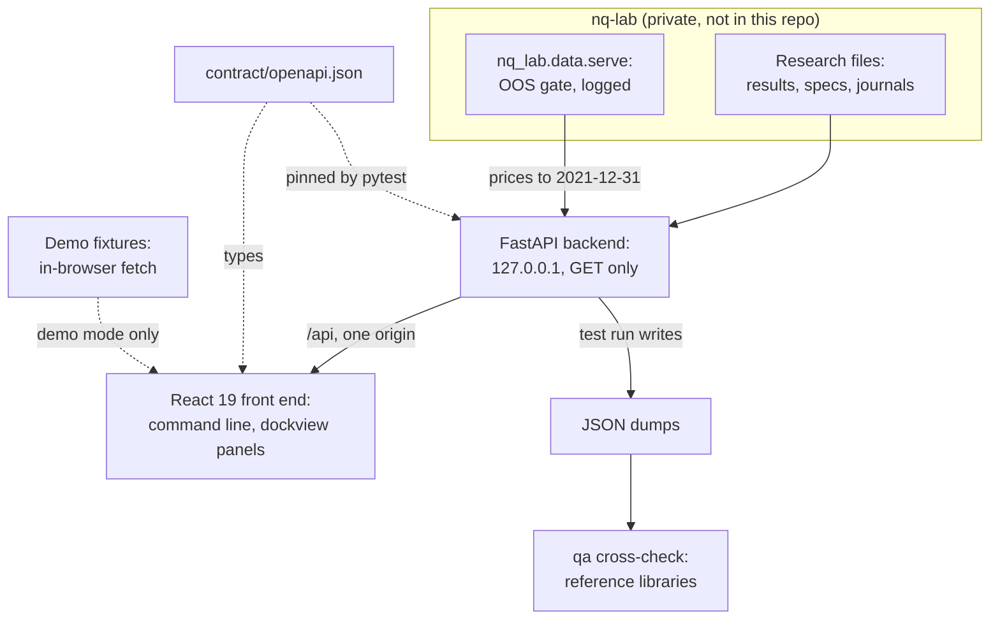

<h1 align="center"></h1>

<p align="center">
  <a href="#try-the-demo">Try the demo</a> ·
  <a href="#screens">Screens</a> ·
  <a href="#keyboard-first">Keyboard</a> ·
  <a href="#full-setup-with-nq-lab">Full setup</a> ·
  <a href="#architecture">Architecture</a> ·
  <a href="#safety-model">Safety model</a> ·
  <a href="#analytics-and-qa">Analytics and QA</a>
</p>

<p align="center">
  <a href="#safety-model"></a>
  <a href="#try-the-demo"></a>
  <a href="#architecture"></a>
  <a href="#architecture"></a>
</p>

<p align="center">
  
</p>
<p align="center"><em>HOME in demo mode: candles, the 27-futures monitor, a hypothesis equity curve and the registry board, linked by groups A and B. Demo prices are synthetic; every screen carries the DEMO DATA flag.</em></p>

**nq-terminal**, the research terminal for nq-lab, runs on your machine and reads nq-lab's NautilusTrader research on
NQ futures. One keyboard-driven screen shows the pre-registered hypotheses, the backtest runs and their analytics, the
out-of-sample audit trail, the sealed results and the IB paper book's journals. The look is a dense, flat-black
terminal: amber on black, function keys, a command line.

> [!IMPORTANT]
> The terminal never places, modifies or cancels an order. It has no order path, and tests fail if one appears.

## Highlights

- **Read only by construction.** All 64 API paths are GET, and tests fail on any other method or on a write call in
  the backend. See the [safety model](#safety-model).
- **No order path.** No IB client exists in the terminal, and tests fail on an IB order call or on any route or
  component named like an order action.
- **One gated door to prices.** Every price read goes through nq-lab's out-of-sample gate, which decides and logs it.
  Nothing after 2021-12-31 is served.
- **Honest labels.** `[PRE-REG]` marks a value read from a registered result and `[POST HOC]` one the terminal
  computed. Sealed windows show as spent.
- **Keyboard first.** 30 mnemonics on a command line drive dockable panels that link by group and share a time
  crosshair. See [Keyboard first](#keyboard-first).
- **Three implementations of the headline metrics.** The terminal's own functions, Nautilus statistics and
  reference libraries must agree. See [Analytics and QA](#analytics-and-qa).
- **Accessible.** The target is WCAG 2.2 AA. [`contrast.test.ts`](web/src/theme/contrast.test.ts) holds every text
  pair at 4.5:1 and every graphic pair at 3:1, in the default theme and both colour-vision-deficiency themes. Every
  canvas chart carries a data summary and a table view.

## Try the demo

The first quick start needs no backend and no nq-lab. You need Node 24 and pnpm 11 through corepack, which may ask
once to download pnpm 11.5.1.

```sh
cd web
corepack pnpm install
corepack pnpm demo
```

Open http://127.0.0.1:5174. The terminal opens on HOME, with DEMO DATA in the frame strip and FIXTURE DATA on the
status line.

> [!NOTE]
> Demo mode runs entirely in the browser on fixture data. Before the terminal renders, the demo replaces the page's
> fetch: it answers `/api` inside the page and refuses any request that is not a GET and any other origin, including
> a real backend on 127.0.0.1:8765. DEMO DATA marks all of it: registry records captured from the real research
> files, hypothesis pages from those files and from the fixture backend, the fixture backend's runs and analytics,
> synthetic prices that never pass through the gate, and market views (`MON`, `CORR`, `VCONE`, `SEAS`, `EVT`) that
> are seeded or hand-built fillers on the backend's scale, not statistics of real prices.
> [`bundleCheck.ts`](web/scripts/bundleCheck.ts) fails a production build that contains demo code.

The demo dataset has gaps, and the screens say so. For example, these answer "not in the demo dataset": intraday
bars (`GIP`, and `GP` at `1m`, `5m` or `1h`), the RUN chart tab, sealed file bodies on `SEAL`, run comparison, the
DES equity section for hypotheses other than volmanaged_v0, `EXPO`, `DQ` and the `EVT` study. `SEAS` holds only NQ
2020 to 2021, and `JOBS` is a labelled P2 placeholder.

<details>
<summary>Build a static demo bundle</summary>

```sh
cd web
corepack pnpm build:demo
```

This writes `web/dist-demo` (git-ignored) and runs the bundle check with `--demo`, which fails a demo build that lacks
the demo code.

</details>

## Walkthrough

<p align="center"></p>
<p align="center"><em>Four commands typed at the command line in demo mode: <code>REG</code>, <code>volmanaged_v0 DES</code>, <code>volmanaged_v0 RET</code>, then <code>HOME</code>. 15 s loop.</em></p>

## Screens

All images come from demo mode. The registry and multiple-testing views are the API's answers on the real research
files, captured on 2026-09-27. The DES pages mix real answers with the fixture backend's; volmanaged_v0's, shown
here, is the fixture backend's. Run and analytics bodies come from the fixture backend. Prices are synthetic, from a
seeded generator, and never pass through the gate, and the market views (`MON`, `CORR`, `VCONE`, `SEAS`, `EVT`) are
seeded or hand-built fillers on the backend's scale, not statistics of real prices.

Six of the eight images keep the full 1920x1080 viewport, so the DEMO DATA flag and the FIXTURE DATA status stay in
frame. OOS and LIVE + JRNL are cropped to their filled upper part, which keeps the DEMO DATA flag. Click an image to
open it at full size.

<table>
  <tr>
    <td width="50%" valign="top"><br><sub><b>REG + MT</b> · Registry board beside the multiple-testing view</sub></td>
    <td width="50%" valign="top"><br><sub><b>volmanaged_v0 DES</b> · One hypothesis: verbatim spec, pass bar, re-hashed spec, costs and linked runs</sub></td>
  </tr>
  <tr>
    <td width="50%" valign="top"><br><sub><b>volmanaged_v0 EQ</b> · Equity against its benchmark; every tile carries its tag, and its popover names the basis and unit</sub></td>
    <td width="50%" valign="top"><br><sub><b>volmanaged_v0 DD</b> · Drawdown: equity and underwater curves against the benchmark, deepest drawdowns listed</sub></td>
  </tr>
  <tr>
    <td width="50%" valign="top"><br><sub><b>volmanaged_v0 RET</b> · Returns and risk: VaR, CVaR, PSR and MinTRL beside the Sharpe-difference test</sub></td>
    <td width="50%" valign="top"><br><sub><b>27F CORR</b> · Clustered correlation matrix with a rolling pair, on seeded demo values</sub></td>
  </tr>
  <tr>
    <td width="50%" valign="top"><br><sub><b>OOS</b> · The gate's access log: every read by caller, sealed reads flagged</sub></td>
    <td width="50%" valign="top"><br><sub><b>LIVE + JRNL</b> · The paper book, read only, above its journals; plumbing rows never feed performance</sub></td>
  </tr>
</table>

The halted row on LIVE is a test fixture in the paper book's journal format. The terminal only displays journals; it
never halts, reconciles or trades anything.

## Keyboard first

The command line reads `[NXTW] [context [SECTOR]] [FUNCTION [args]] [HELP] <GO>`. The context is an instrument (one
of the 27 futures, or a generic ticker such as `NQ1`), a hypothesis, a run id, or `27F` for the universe. Leave it out
to use the focused panel's link group. Examples: `NQ GP`, `NQ1 Index GP`, `volmanaged_v0 DES`, `27F CORR`, `REG`,
`GP HELP`.

| Key | Action |
|---|---|
| <kbd>Enter</kbd> | `<GO>`: run the command line |
| <kbd>Shift</kbd>+<kbd>Enter</kbd> | Open the result in a new panel, the same as `NXTW` before the command |
| <kbd>Esc</kbd> | CANCEL: close the open list or menu; else clear the typed line; else return to the panel |
| <kbd>F1</kbd> | HELP for the focused screen or the typed function; twice quickly opens the HELP index |
| <kbd>F8</kbd> to <kbd>F11</kbd> | Insert a sector key: Equity, Comdty, Index, Curncy |
| <kbd>End</kbd> | BACK in the focused panel |
| <kbd>PgUp</kbd> / <kbd>PgDn</kbd> | Page back and forward; a number first (`3` <kbd>PgDn</kbd>) jumps that many pages |
| <kbd>Alt</kbd>+<kbd>1</kbd>…<kbd>9</kbd> | Focus panel 1 to 9 |
| <kbd>Ctrl</kbd>+<kbd>K</kbd> | Focus the command line and select its text |
| <kbd>Alt</kbd>+<kbd>K</kbd> | Show or hide the key map |
| `N` <kbd>Enter</kbd> | Run numbered item N of the focused panel: menu rows, tabs, the HELP index |
| Chart focused | <kbd>Left</kbd> / <kbd>Right</kbd> step the crosshair one bar, <kbd>+</kbd> / <kbd>-</kbd> zoom, <kbd>Home</kbd> / <kbd>End</kbd> jump to the data ends, <kbd>T</kbd> toggles the table view |

Panels in link group A, B or C share one context: setting it in one panel retargets every panel of the group and
syncs their time crosshair. `HELP <GO>` lists every function and key.

<p align="center"></p>
<p align="center"><em>Suggestions group functions, instruments, hypotheses and runs as you type.</em></p>

<p align="center"></p>
<p align="center"><em>MENU lists related functions, numbered; type the number and <code>&lt;GO&gt;</code>.</em></p>

<details>
<summary>All 30 mnemonics</summary>

From [`web/src/commands/registry.ts`](web/src/commands/registry.ts), in HELP's order. P0 shipped first, P1 after it;
P2 is built only on request.

| No. | Mnemonic | Screen | Context | Pri |
|---:|---|---|---|---|
| 1 | `HOME` | Home view | none | P0 |
| 2 | `GP` | Candles with volume and roll markers | instrument, optional timeframe `1m`, `5m`, `1h` or `1d` | P0 |
| 3 | `GIP` | Intraday candles for one date | instrument, then a date | P0 |
| 4 | `DES` | Hypothesis tear sheet or instrument description | hypothesis or instrument | P0 |
| 5 | `REG` | Registry board | none | P0 |
| 6 | `MT` | Multiple-testing view | none | P0 |
| 7 | `RUNS` | Nautilus runs table | none | P0 |
| 8 | `RUN` | Run inspector | run | P0 |
| 9 | `EQ` | Analytics: equity | run or hypothesis | P0 |
| 10 | `DD` | Analytics: drawdown | run or hypothesis | P0 |
| 11 | `RET` | Analytics: returns and risk | run or hypothesis | P0 |
| 12 | `RR` | Analytics: rolling statistics | run or hypothesis | P0 |
| 13 | `MRET` | Analytics: monthly returns | run or hypothesis | P0 |
| 14 | `MON` | 27-futures monitor | `27F` | P0 |
| 15 | `CORR` | Correlation matrix | `27F` | P0 |
| 16 | `LEDG` | Ledger | none | P0 |
| 17 | `OOS` | Gate access log and openings | none | P0 |
| 18 | `LIVE` | Paper book | none | P0 |
| 19 | `JRNL` | Journals | none | P0 |
| 20 | `HELP` | Mnemonics and keys, with link groups and licences | none | P0 |
| 21 | `COST` | Cost ladder | run or hypothesis | P1 |
| 22 | `BLK` | Blocks | hypothesis | P1 |
| 23 | `EXPO` | Exposure | run | P1 |
| 24 | `SEAL` | Sealed results | hypothesis | P1 |
| 25 | `VCONE` | Volatility cone | instrument | P1 |
| 26 | `SEAS` | Seasonality | instrument or hypothesis | P1 |
| 27 | `EVT` | Event study | instrument | P1 |
| 28 | `ROLL` | Roll calendar | instrument | P1 |
| 29 | `DQ` | Data quality | instrument | P1 |
| 30 | `JOBS` | Backtest queue | none | P2, placeholder |

The line also knows a few words of its own: `HL` searches the help pages, hypotheses and runs, `MENU` opens the
related functions, `LAST` lists the last 8 commands, `MAIN` is `HOME`, and `NO` turns the event tape on or off.

</details>

## Full setup with nq-lab

The second quick start runs the terminal on nq-lab's research files.

The folder sits at `nq-lab\terminal`. The backend runs in the nq-lab virtual environment (`nq-lab\.venv`), which
provides `nq_lab`, `nautilus_trader`, FastAPI and uvicorn. It reads the research files next to it: results, specs,
journals and the processed data, which are not in this repository.

For the front end you need Node 24 and pnpm 11. The cross-check needs uv, which builds its own environment in
`terminal\qa` and never touches `nq-lab\.venv`.

From the `nq-lab` folder, in PowerShell:

```powershell
powershell -NoProfile -ExecutionPolicy Bypass -File terminal\start.ps1
```

The script checks that the venv imports FastAPI and uvicorn. When `web\dist` is older than the front-end sources it
rebuilds it (`pnpm install --frozen-lockfile`, then `pnpm build`). It then starts the backend on
http://127.0.0.1:8765 and opens the browser once `/api/health` answers. Ctrl+C stops everything it started. If the
terminal already answers on that port, the script opens the browser on it and starts nothing.

In the browser, type a function code in the command line and press Enter (`<GO>`). `HELP <GO>` lists every function
and key; see [Keyboard first](#keyboard-first).

<details>
<summary>start.ps1 options</summary>

| Option | Effect |
|---|---|
| `-Port 8790` | Serve on another loopback port (default 8765) |
| `-NoBrowser` | Do not open the browser |
| `-NoBuild` | Serve `web\dist` as it is, even when it is older than the sources |
| `-DryRun` | Print the plan (paths, commands, port, build decision) and start nothing |
| `-Dev` | Backend under `uvicorn --reload` on 8765, plus the Vite dev server on 127.0.0.1:5173 |

`-Dev` is for front-end work: the dev server proxies `/api` to the backend, and port 8765 must be free, so stop the
normal server first.

To see what the script would do without starting anything:

```powershell
powershell -NoProfile -ExecutionPolicy Bypass -File terminal\start.ps1 -DryRun
```

</details>

<details>
<summary>Fixture mode</summary>

Fixture mode points the backend at the small test files in `backend\tests\fixtures` instead of the research files.
Nothing there is a price source, so the chart and market screens answer 503; every other screen works.

```powershell
$env:NQT_FIXTURE_DIR = "$PWD\terminal\backend\tests\fixtures"
powershell -NoProfile -ExecutionPolicy Bypass -File terminal\start.ps1 -Port 8790
Remove-Item Env:NQT_FIXTURE_DIR
```

</details>

Ports: 8765 serves the built front end and `/api` from one origin; `-Dev` adds the Vite dev server on 5173; the demo
runs on 5174; the Playwright tests use 8795 and 4273 by default and refuse 8765. All of them bind 127.0.0.1.

## Architecture



- **Backend.** FastAPI 0.141.1 on uvicorn 0.54.0 in the nq-lab venv, package `nq_terminal`, JSON through orjson. It
  binds 127.0.0.1, answers GET only, and serves the built front end and `/api` from one origin.
- **Contract.** [`contract/openapi.json`](contract/openapi.json) holds 64 paths. pytest compares `app.openapi()` with
  it; `pnpm gen:api` generates the front end's types with openapi-typescript, and `pnpm test` fails first when they
  have drifted.
- **Front end.** React 19.3.0, TypeScript 6.0.3 and Vite 8.3.1: dockview panels under a command line built on cmdk,
  with zustand and TanStack Query. Every screen loads lazily.
- **Charts and grids.** uPlot for line stacks, TradingView Lightweight Charts for candles, Apache ECharts tree-shaken
  to four series types (bar, line, scatter, custom) for its five chart kinds, TanStack Table with virtual rows, and
  Perspective pivots (WebAssembly) on LEDG, the RUN trades and fills, and the OOS log, each behind a Table or Pivot
  toggle.
- **Live data.** While LIVE or JRNL is on screen, `/api/live/stream` sends Server-Sent Events. The client falls back to
  2 s polling when the browser has no EventSource, the stream is refused, or a reconnect takes over 8 s.
- **Demo.** [`web/src/demo/`](web/src/demo) replaces the page's fetch and EventSource before the terminal renders. Its
  route table has one handler per contract path, typed so that a missing path fails the compile.
- **qa.** A separate uv project (Python 3.12) pinning quantstats 0.0.82, empyrical-reloaded 0.5.12, arch 8.0.0,
  statsmodels 0.15.0 and scipy 1.18.1. It reads the JSON dumps the backend tests write and never imports the backend.

[`web/scripts/bundleCheck.ts`](web/scripts/bundleCheck.ts) runs after every `pnpm build`. It fails a build that goes
over budget or loads a chart or grid library with the shell.

| Chunk, gzip | Budget | Measured 2026-09-29 |
|---|---:|---:|
| Shell (index, React, vendor, runtime, preload, commands, sectors) | 126.8 kB | 125.4 kB |
| uPlot | 30.0 kB | 22.1 kB |
| Lightweight Charts | 75.0 kB | 61.4 kB |
| ECharts | 230.0 kB | 201.6 kB |
| TanStack grid | 45.0 kB | 18.7 kB |
| Perspective | 100.0 kB | 86.1 kB |

`scripts/shellBudget.test.ts` pins the shell ceiling (the gallery build gets 127.6 kB); raise it only in the change that needs the room, and say why.

**Status.** P0 and P1 are built: 29 of the 30 mnemonics open a screen. P2, the `JOBS` backtest queue and a read-only
IB snapshot, is not built and waits for the owner's decision.

<details>
<summary>Decisions</summary>

The full log is [`docs/PRD.md`](docs/PRD.md) section 7, with later decisions in
[`docs/ARCHITECTURE.md`](docs/ARCHITECTURE.md) section 4 and the look spec section 7. The ones that shape daily use:

- **One origin.** uvicorn on 127.0.0.1:8765 serves both the built front end and `/api`. The Vite server runs only in
  `-Dev` mode.
- **In-memory price cache.** A copy of prices on disk would be an ungated copy, so there is none.
- **Counts from files.** Registry counts and verdicts, with the adjusted p values, come from `results\registry.csv`
  at run time, never from the code.
- **Real fills beside their own strategy.** The quote-check sample shows on za_orb runs only, and the paper book's
  close rows on volmanaged runs only.
- **Reduced templates.** Where the look spec asks for something the API does not send, a screen shows less and says
  so. The list is in the look spec section 7.
- **Grids and live data.** P0 grids are TanStack Table with virtual rows. Perspective pivots and server-sent events
  for LIVE and JRNL, with a fallback to 2 s polling, are built (P1). A backtest queue and a read-only IB snapshot
  remain P2 and wait for the owner's decision.

</details>

## Safety model

The research rules of nq-lab (the nq-lab project rules) bind the backend, and the terminal is built so that it cannot
break them.

<p align="center"></p>
<p align="center"><em>The status line on every screen: the served window, FIXTURE DATA in demo mode, gate reads, READ ONLY and NO ORDER PATH.</em></p>

- **Read only.** Every route is GET; a test pins the route set and fails on any other method. A syntax-tree scan
  bans write calls anywhere in the backend. The ledger is never written: for an eligible run, RUN shows the
  `scripts\ledger_append.py` command for you to copy and run yourself. Tests:
  [`test_app.py`](backend/tests/test_app.py), [`test_safety_ast.py`](backend/tests/test_safety_ast.py).
- **One door to prices.** Every price read goes through `nq_lab.data.serve` with caller `terminal`, so the OOS gate
  decides and logs each read. `serve_sealed` is never called, and nothing after 2021-12-31 is served. The same
  scan bans direct parquet reads. Prices are cached in memory by calendar year, never on disk, so a normal
  session adds a handful of lines to `results\oos_access_log.jsonl`, each with caller `terminal`. Tests:
  [`test_safety_ast.py`](backend/tests/test_safety_ast.py).
- **No order path.** No IB client exists in the terminal. A scan bans IB order calls across `terminal\`, and the
  browser tests assert that every request is a GET and that no route or component is named like an order action.
  Tests: [`test_safety_ast.py`](backend/tests/test_safety_ast.py), [`safety.spec.ts`](web/e2e/flows/safety.spec.ts).
- **Local only.** The server binds 127.0.0.1 in code and refuses a peer that is not loopback. It accepts only the
  hosts 127.0.0.1 and localhost and has no CORS. A same-origin guard stops another page from triggering gate reads.
  Every response sends a strict content security policy and refuses framing: `default-src 'self'` and
  `frame-ancestors 'none'`, with `X-Frame-Options: DENY`, `nosniff`, `no-referrer` and no Server header. The
  policy's `'wasm-unsafe-eval'` is there only for Perspective's WebAssembly. Tests:
  [`test_app.py`](backend/tests/test_app.py), [`test_csp_wasm.py`](backend/tests/test_csp_wasm.py).
- **No private data out.** Error bodies and served research files carry no local paths. Account ids are masked, and
  environment values are reported as set or unset.
- **Honesty on screen.** Values the terminal computes carry `[POST HOC]`; values read from a registered result
  carry `[PRE-REG]`. Sealed results show as a spent window. Plumbing rows keep the paper book's banner and never
  feed a performance chart, and a run whose balance check fails is marked unusable and not drawn.
- **Tests leave the research alone.** During the backend tests an audit hook refuses any write, removal or rename
  under `results\`, `backtests\output\`, `data\` or `live\`. A session fixture hashes `oos_access_log.jsonl`,
  `ledger.csv`, `registry.csv` and `oos_openings.json` before and after. Tests that touch the gate use a fake
  serve with a temporary log. Tests: [`research_guard.py`](backend/tests/research_guard.py),
  [`test_research_guard.py`](backend/tests/test_research_guard.py).

## Analytics and QA


**Three implementations.** The terminal's own numpy and pandas pure functions produce every number on screen.
Nautilus statistics are the second implementation, inside the backend tests. The `qa` project's reference libraries
are the third: quantstats 0.0.82, empyrical-reloaded 0.5.12, arch 8.0.0 and statsmodels 0.15.0 recompute every value
the backend tests dump. Closed forms agree to 1e-9 relative, anchors to the project's own files to 1e-12, and the
bootstrap exactly under a fixed seed.

**What never reaches the screen.** Nautilus's alpha, its tear sheet and `PortfolioAnalyzer.portfolio_returns()` never
produce a displayed number: they zero-fill weekends and annualise geometrically.

**Two return bases, always named.** Basis A is a research screen's own series (r = PnL / K); Basis B is a Nautilus
account, compounded from K. Every chart names its basis and unit, and every tile names them in its popover. P is 252
for daily series and 12 for monthly ones, sessions only, and the risk-free rate is 0.

**Born-failing checks.** A tampered spec hash, a shifted anchor, a plumbing row reaching a performance series, a price
read that bypasses the gate and a wrong annualisation factor (√365) must each make a test fail.

**The catalogue.** [`docs/ANALYTICS_CATALOG.md`](docs/ANALYTICS_CATALOG.md) lists 74 metrics (41 P0, 26 P1, 7 P2),
from performance and drawdowns to research integrity and live paper monitoring. The strict cross-check runs recorded
in it on 2026-09-27: P1 bundles PASS 1,453, FAIL 0, INFO 84; Phase 11 bundles PASS 467, FAIL 0.

<br clear="right">

| Layer | What it proves | Size (2026-09-28, `ac70607`) | Command |
|---|---|---|---|
| Backend pytest | GET-only routes, loopback and header rules, the syntax-tree bans, every API view, analytics against Nautilus statistics and the anchors; writes the QA dumps | 1,239 test functions in 91 files | nq-lab venv's pytest, see Test commands |
| qa cross-check | Every dumped value, recomputed by the reference libraries | 108 tests, plus `crosscheck --strict` | `uv run --project terminal\qa ...` |
| Vitest | The contract check first, then view models, copy rules, colour contrast and the demo layer | 2,417 tests in 218 files | `pnpm --dir terminal\web test` |
| Types and build | `tsc -b` over the app; a production build under the bundle budgets | n/a | `test:types`, `build` |
| Playwright with axe | Every mnemonic in Chromium: GET-only traffic, no order-like names, the keys, axe scans, screenshots | 357 tests in 32 specs (354 run by `pnpm e2e`, 3 perf), 170 screenshot baselines | `pnpm --dir terminal\web e2e` |

The table gives suite sizes, not pass rates. The backend suite needs the private nq-lab venv. Two tests assume the
nq-lab layout, with this repository as `terminal\` inside nq-lab, and fail outside it:
`web/src/grids/JournalTable.model.test.ts` reads nq-lab's `src/nq_lab/paper_plumbing.py`, and qa's
`test_the_default_dump_folder_is_under_terminal_qa` expects the qa folder's parent to be named `terminal`.

<details>
<summary>Test commands</summary>

From the `nq-lab` folder, in PowerShell:

```powershell
# Backend (it also writes the JSON dumps the cross-check reads, into terminal\qa\.dumps)
& .venv\Scripts\python.exe -m pytest -p no:warnings -o addopts="" -q terminal\backend\tests

# Independent cross-check: its own tests, then every dumped value against the reference libraries
uv run --project terminal\qa python -m pytest -q terminal\qa\tests
uv run --project terminal\qa python -m crosscheck --strict

# Front end: the contract check with the unit tests, the type check and a production build
pnpm --dir terminal\web test
pnpm --dir terminal\web test:types
pnpm --dir terminal\web build
```

The Playwright tests start their own fixture backend and a preview server on two spare loopback ports (8795 and
4273 by default). Nothing they do reaches the research files or the real audit log. Choose other ports when those
are taken; port 8765 is refused:

```powershell
$env:NQT_E2E_API_PORT = "8796"; $env:NQT_E2E_WEB_PORT = "4274"
pnpm --dir terminal\web e2e
Remove-Item Env:NQT_E2E_API_PORT, Env:NQT_E2E_WEB_PORT
```

The first run on a new machine needs the browser: `pnpm --dir terminal\web exec playwright install chromium`.

When the backend's API changes on purpose, regenerate the contract and the front-end types together:

```powershell
$env:NQT_UPDATE_CONTRACT = "1"
& .venv\Scripts\python.exe -m pytest -p no:warnings -o addopts="" -q `
  terminal\backend\tests\test_openapi_contract.py
Remove-Item Env:NQT_UPDATE_CONTRACT
pnpm --dir terminal\web gen:api
```

User-facing text lives in `web\src\copy\`. A unit test there checks every copy module for em and en dashes and US
spellings, and another fails if a screen or chrome file holds a prose string of its own.

</details>

## Repository layout

| Path | What it holds |
|---|---|
| `backend/` | The FastAPI package `nq_terminal` and its tests. It binds to 127.0.0.1 only |
| `web/` | The front end (React 19 on Vite, in TypeScript): a command line over dockable panels. Demo mode lives in `web/src/demo/` |
| `qa/` | An independent cross-check that recomputes the headline analytics with reference libraries; it never imports the backend |
| `contract/openapi.json` | The API contract. The front end's types are generated from it, and both sides test that they still match it |
| `docs/` | The design notes: [`PRD.md`](docs/PRD.md), [`ARCHITECTURE.md`](docs/ARCHITECTURE.md), [`UI_SPEC.md`](docs/UI_SPEC.md), [`ANALYTICS_CATALOG.md`](docs/ANALYTICS_CATALOG.md) and the look spec [`BLOOMBERG_LOOK.md`](docs/BLOOMBERG_LOOK.md). [`docs/media/`](docs/media) holds the images on this page |
| `start.ps1` | The one start command |

## Credits

Built for research on [NautilusTrader](https://github.com/nautechsystems/nautilus_trader) 1.231.0, which nq-lab uses
as a library, unmodified. The UI stands on dockview, uPlot, TradingView Lightweight Charts, Apache ECharts, TanStack
(Table, Virtual, Query), Perspective, cmdk and zustand. The fonts are Bergoom, Source Sans 3 and PT Mono, under the
SIL Open Font Licence 1.1 and self-hosted.

Candlestick charts use TradingView Lightweight Charts (Apache-2.0); the TradingView attribution logo stays on every
candle chart.

> TradingView Lightweight Charts™\
> Copyright (с) 2025 TradingView, Inc. [https://www.tradingview.com/](https://www.tradingview.com/)

Not affiliated with or endorsed by Bloomberg L.P.; Bloomberg and Bloomberg Terminal are trademarks of Bloomberg
Finance L.P.

No licence file is published.
