<h1 align="center">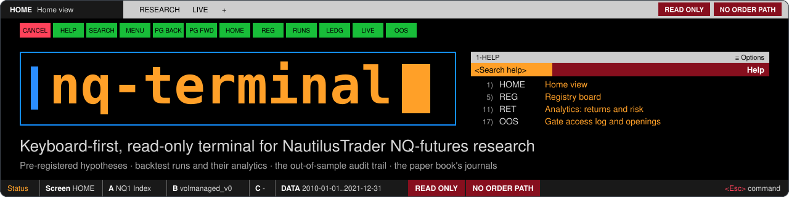</h1>

<p align="center">
  <a href="#status">Status</a> ·
  <a href="#try-the-demo">Try the demo</a> ·
  <a href="#install-on-windows">Install on Windows</a> ·
  <a href="#start-it-from-source">Start it from source</a> ·
  <a href="#screens">Screens</a> ·
  <a href="#how-it-is-built">How it is built</a> ·
  <a href="#safety-model">Safety model</a> ·
  <a href="#testing-and-quality-gates">Testing</a> ·
  <a href="#documentation">Docs</a>
</p>

<p align="center">
  <a href="#safety-model"></a>
  <a href="#try-the-demo"></a>
  <a href="#install-on-windows"></a>
  <a href="#how-it-is-built"></a>
</p>

<p align="center">
  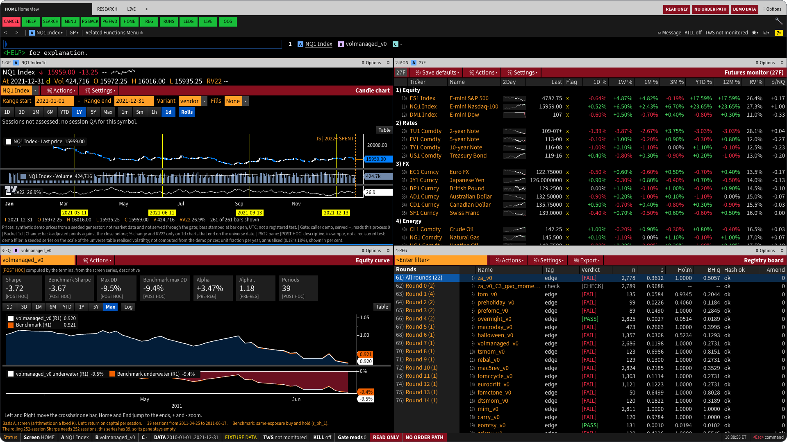
</p>
<p align="center"><em>HOME in demo mode. Demo prices are synthetic, and every screen carries the DEMO DATA flag.</em></p>

**nq-terminal** is a local research terminal for nq-lab, a private NautilusTrader research project on NQ (Nasdaq-100
E-mini) futures. It runs on your own machine and shows that research on one keyboard-driven screen: the pre-registered
hypotheses, the backtest runs and their analytics, the out-of-sample audit trail, the sealed results and the journals of
the IB paper book. It looks like a dense, flat-black terminal: amber on black, function keys and a command line. It comes
as a web app you start from a script, and since 4 October 2026 also as a Windows desktop app.

It is not a trading platform. It never places, modifies or cancels an order, never connects to a real broker account,
and reads market data only through nq-lab's data gate, which serves nothing after the in-sample end date of 2021-12-31.
Tests enforce all three. It is a personal research tool shared in public: the code is here to read and to try in demo
mode, and the full terminal needs the private nq-lab checkout beside it.

> [!IMPORTANT]
> The terminal has no order path. Tests fail if an order call, or a route or component named like an order action,
> appears anywhere in the terminal.

## Status

As of 4 October 2026:

- **Web terminal.** Built: 30 of the 30 mnemonics open a screen, on 84 API paths.
- **Windows desktop app, 0.2.1.** Released on 5 October 2026 as the annotated tag desktop-v0.2.1, on commit `3b22af0`: an
  unsigned, per-user installer of 3,257,242 bytes ([hand-over](docs/desktop/handover_windows.md), section 1). It is 0.2.0
  with a start that survives a slow first identity proof: the backend answers the first proof from values it read at
  start-up, and the shell retries a late first proof before it refuses (120 of 120 hidden launches checked, none refused).
  0.2.0 added the research launcher ([`docs/research_launcher.md`](docs/research_launcher.md)): a Start from form on LEDG and RUN that
  queues a backtest of a registered strategy (`POST /api/jobs/actions`), a job indicator in the chrome that reads the job
  list quietly (every 15 s while idle, every 2 s while a job is active) and announces a finished job, an anchor badge
  with a one-click re-run, and a low WebView2 memory target while the window is minimised or hidden. The job indicator's
  reads of the job list count as background polls, so the quiet-period trim still fires at HOME. The earlier releases
  stay available: 0.2.0 (`desktop-v0.2.0`, commit `19658fe`, 3,256,246 bytes), 0.1.2 (`desktop-v0.1.2`, commit `5153496`, 3,254,474 bytes), which trims the backend's working set
  after the HOME prewarm and in quiet periods, 0.1.1 (`desktop-v0.1.1`, 3,253,307 bytes), which capped the maths thread
  pools of the backend server, and 0.1.0 (`desktop-v0.1.0`, commit `8122c87`, 3,253,432 bytes).
- **Known limitation of 0.2.0, fixed in 0.2.1.** About 1 start in 240 stopped on the shell's identity check: the first
  start after a Windows Defender signature update can take the backend longer than the shell's 2 s link budget. It
  existed since 0.1.x and 0.2.1 fixes it; on 0.2.0, close the app and open it again.
- **Gate G2 (speed and memory on Windows).** **AUTOMATED PASS, OWNER ROWS PENDING.** Whole-app idle memory at HOME
  reads 196.1 MB on 0.2.1 (179.8 to 199.9 MB, trim on, read 73 s after HOME ready; 197.1 MB on 0.2.0 and 199.0 MB on 0.1.2), inside both the
  500 MB ceiling and the 400 MB target. On 0.1.1 it read 477.3 MB at HOME ready plus 2.5 s, another reading point, and on 0.1.0 505.4 MB,
  over the ceiling. Every other row re-measured on 0.2.1 is inside its ceiling at the median and in every single launch, among them
  first-launch cold HOME at 3,304 ms. The 2-hour soak (largest sample 705.8 MB, a partial run, not all day) and the drift run were taken on
  0.1.0 and not repeated since; 0.2.0 added a 30-minute partial soak (largest sample 619.9 MB) and the first minimise
  readings of the new memory target, and no soak was run on 0.2.1. The owner-attended checks (screen readers, real keyboard,
  visible run, SmartScreen first run and others) are still pending. Source: [G2 verdict](docs/desktop/g2_windows/verdict.md).
- **macOS app.** Not built. It waits for its own gate (G1). On macOS and Linux, use the web terminal or the demo.

## Highlights

- **Read only by construction.** All 84 API paths are GET, bar four writes: queueing and stopping a backtest on the
  `JOBS` screen (`POST /api/jobs`, `DELETE /api/jobs/{job_id}`), starting a run of a registered strategy from a ledger
  row or re-running an anchor (`POST /api/jobs/actions`, see [the research launcher](docs/research_launcher.md)) and
  saving a workspace (`PUT /api/workspaces/{doc}`). Tests fail on any other method.
- **One gated door to prices.** Every price read goes through nq-lab's out-of-sample gate, which decides and logs it.
- **Honest labels.** `[PRE-REG]` marks a value read from a registered result and `[POST HOC]` one the terminal
  computed. Sealed windows show as spent. The terminal adds no pass or fail of its own.
- **Keyboard first.** 30 mnemonics on a command line drive dockable panels that link by group and share a time
  crosshair. `HL` searches functions, metrics, instruments and help text.
- **Exports keep their labels.** `GRAB` saves a panel as an image whose caption names its basis, unit, tag and source.
- **Three implementations of the headline metrics.** The terminal's own functions, Nautilus statistics and reference
  libraries must agree ([Testing](#testing-and-quality-gates)).
- **Accessible by target.** WCAG 2.2 AA, with colour contrast pinned by a test in every theme ([Accessibility](#accessibility)).

## Try the demo

The demo needs no backend, no Python and no nq-lab. You need Node 24 (`web/.nvmrc` says 24, `engines` in
`web/package.json` asks for 24 or later, and `web/pnpm-workspace.yaml` sets `engineStrict: true`) and pnpm 11 through
corepack, which may ask once to download pnpm 11.5.1.

On macOS or Linux, from the repository folder:

```sh
./start.sh --demo
```

On any system, Windows included:

```sh
corepack pnpm --dir web install
corepack pnpm --dir web demo
```

Open http://127.0.0.1:5174. The terminal opens on HOME, with DEMO DATA in the frame strip and on the status line.

Before the terminal renders, the demo replaces the page's fetch and EventSource and answers `/api` inside the page from
fixtures. It refuses any request that is not a GET and any other origin, a real backend on port 8765 included, so
nothing is sent anywhere.

> [!NOTE]
> DEMO DATA marks all of it: registry records captured from the real research files, the fixture backend's runs and
> analytics, synthetic prices that never pass through the gate, and market views (`MON`, `CORR`, `VCONE`, `SEAS`,
> `EVT`) that are seeded fillers, not statistics of real prices. In the demo, `HELP <GO>` opens with "About this demo",
> which says which answers are captured, which are synthetic and which are gaps.

<details>
<summary>More about the demo</summary>

- **Gaps say so.** A path or request the demo holds no honest body for answers "not in the demo dataset". That is a
  gap in the demo, not a fault and not a finding. The route table is [`web/src/demo/routes.ts`](web/src/demo/routes.ts):
  one handler per contract path, typed so that a missing path fails the compile.
- **No demo code in a production build.** [`bundleCheck.ts`](web/scripts/bundleCheck.ts) fails a production build that
  contains demo code, and a demo build that lacks it.
- **Static bundle.** `corepack pnpm --dir web build:demo` writes `web/dist-demo` (git-ignored). A built demo bundle
  carries snapshots of real research files, so it is for your own machine, not for publishing.

</details>

## Install on Windows

The desktop app is a Tauri shell ([`desktop/`](desktop/README.md)) that opens one window over the page the lab's own
backend serves. **It is not standalone:** on first run it asks for an nq-lab folder and accepts one only when it holds
the lab's virtual environment and this terminal. Without the private nq-lab checkout, use the [demo](#try-the-demo).

**1. Get the installer.** Installers are attached to releases on this repository's
[Releases page](https://github.com/FatihHekim0glu/nq-terminal/releases). On the build PC the owner's copy sits in the
release folder that section 2 of the [hand-over](docs/desktop/handover_windows.md) names, with `SHA256SUMS` and
`PROVENANCE.json` beside it.

| Release | File | Size | SHA256 |
|---|---|---:|---|
| `desktop-v0.2.1` | `nq-lab terminal_0.2.1_x64-setup.exe` | 3,257,242 bytes | `34144639ef1a6c633d3ced581bf80362434a3cbd35f806fc229f932a25b1cd20` |
| `desktop-v0.2.0` | `nq-lab terminal_0.2.0_x64-setup.exe` | 3,256,246 bytes | `ff7266397131e15d101fa0b38105b0d0f7b855ba1d22f4a688906a4ef2feeb51` |
| `desktop-v0.1.2` | `nq-lab terminal_0.1.2_x64-setup.exe` | 3,254,474 bytes | `3ab330927d6b1e1c617163a5ff8089baae8e2da4ac553b2b6527cedf4569f377` |
| `desktop-v0.1.1` | `nq-lab terminal_0.1.1_x64-setup.exe` | 3,253,307 bytes | `3b45f791bc94bf3df3a9e6c3400ff6e56fc289478f651ed59b1e95c013602efc` |
| `desktop-v0.1.0` | `nq-lab terminal_0.1.0_x64-setup.exe` | 3,253,432 bytes | `2f4b5c4cdf37a5a520be4517d7efd725288ac9ae28b047e85b302e9f52c4b590` |

**2. Verify the hash before you run it.** In PowerShell, in the folder that holds your copy:

```powershell
Get-FileHash -Algorithm SHA256 -LiteralPath '.\nq-lab terminal_0.2.1_x64-setup.exe' | Format-List Algorithm,Hash
```

PowerShell prints the hash in capitals; compare it with the value above without regard to case. If it differs by one
character, delete the copy and do not run it.

**3. Expect SmartScreen.** The installer is unsigned by the owner's decision, so a downloaded copy shows "Windows
protected your PC" with "Unknown publisher". After you have checked the hash, choose "More info", then "Run anyway". If
Smart App Control is on, Windows refuses an unsigned program outright with no "Run anyway" button. Why the build is
unsigned, what signing would cost and the record to keep of the first run are in
[`docs/desktop/smartscreen.md`](docs/desktop/smartscreen.md).

**4. Install.** The installer is per user and never asks for administrator rights; if a prompt asks for them, cancel it.

- The default folder is `%LOCALAPPDATA%\Programs\nq-lab terminal`. You can pick another; the installer refuses a drive
  root, a network path, Program Files, the Windows folder and any folder holding files that are not its own.
- It creates the folder with a protected permission list (you, SYSTEM and Administrators only) and adds a Start menu
  entry and an uninstall entry. It installs no lab and no data.
- On first run, choose your nq-lab folder and the WebView2 data folder. The app saves both in `settings.json` under
  `%APPDATA%\dev.nqlab.terminal`.

**Uninstall and roll back.** Uninstall from Settings, Apps, "nq-lab terminal", or run `uninstall.exe` in the install
folder. The uninstaller removes only what the installer wrote; the lab, its research files and `terminal\state` are
never touched. There is no updater: an update is a new installer run by hand. To roll back, uninstall, then install the
older installer after checking its hash. Back up your workspaces first, and leave the "delete app data" box in the
uninstaller unticked unless you mean to reset the app: ticked, it removes `%APPDATA%\dev.nqlab.terminal`, including
`settings.json`. Sections 2 to 6 and section 8 of the [hand-over](docs/desktop/handover_windows.md) have the exact
commands, the permission check and the troubleshooting table.

The app and the browser terminal can run at the same time. They share one backend per lab: whichever starts first owns
it and the other attaches. Every `/api` path, on either door, answers 401 without the session token.

## Start it from source

### Windows, with nq-lab

The folder sits inside the nq-lab checkout as `nq-lab\terminal`. The backend runs in the nq-lab virtual environment
(`nq-lab\.venv`), which provides `nq_lab`, `nautilus_trader`, FastAPI and uvicorn, and reads the research files next
to it. Neither is in this repository. You also need Node 24 and pnpm 11 for the front end, and uv for the cross-check.

From the `nq-lab` folder, in PowerShell:

```powershell
powershell -NoProfile -ExecutionPolicy Bypass -File terminal\start.ps1
```

The script checks that the venv imports FastAPI and uvicorn, rebuilds `web\dist` when it is older than the sources
(`pnpm install --frozen-lockfile`, then `pnpm build`), starts the backend on http://127.0.0.1:8765 with an allow-listed
environment, and opens the browser on a one-time link that swaps its code for a session cookie. The code lives 60
seconds and works once. **Closing the script's window stops the backend**; Ctrl+C does the same. When a backend of this
lab is already running (the desktop app's, for example), the script attaches to it and starts nothing.

In the browser, type a function code in the command line and press Enter (`<GO>`). `HELP <GO>` lists every function
and key.

<details>
<summary>start.ps1 options, fixture mode and ports</summary>

| Option | Effect |
|---|---|
| `-Port 8790` | Serve on another loopback port (default 8765) |
| `-NoBrowser` | Do not open the browser: print the one-time link instead |
| `-NoBuild` | Serve `web\dist` as it is, even when it is older than the sources |
| `-DryRun` | Print the plan (paths, commands, port, build decision) and start nothing |
| `-Dev` | Backend under `uvicorn --reload`, plus the Vite dev server on 127.0.0.1:5173 |
| `-DevPort 5180` | Serve the dev server on another port (default 5173) |

`-Dev` is for front-end work: the dev server proxies `/api` to the port the backend's lock records. It stops with a
message when a backend already holds the lock, so stop the normal server first.

**Fixture mode** points the backend at the small test files in `backend\tests\fixtures` instead of the research files.
Nothing there is a price source, so the chart and market screens answer 503; every other screen works.

```powershell
$env:NQT_FIXTURE_DIR = "$PWD\terminal\backend\tests\fixtures"
powershell -NoProfile -ExecutionPolicy Bypass -File terminal\start.ps1 -Port 8790
Remove-Item Env:NQT_FIXTURE_DIR
```

**Read-only IB snapshot** (off by default):

| Variable | Meaning |
|---|---|
| `NQT_IB_READONLY` | Set to exactly `1` to show a paper TWS or Gateway on this machine on `LIVE`, as API client 95: account summary, positions, working orders (view only) and today's executions |
| `IB_HOST` | Default 127.0.0.1; a host that is not this machine is refused |
| `IB_PORT` | Default 7497 (TWS paper; Gateway paper is 4002). The live ports 7496 and 4001 are refused |

**Ports.** 8765 serves the built front end and `/api` from one origin; `-Dev` adds 5173; the demo runs on 5174; the
Windows Playwright tests use 8795 and 4273 by default and refuse 8765; the offline Playwright tests use 4373 and 4374.
All of them bind 127.0.0.1. The desktop app takes a free port of its own.

</details>

### macOS and Linux

`start.sh` is the macOS and Linux counterpart of `start.ps1`. Run it from the repository folder:

```sh
./start.sh doctor
./start.sh --dry-run --no-browser
./start.sh
```

`./start.sh doctor` checks the machine (Node, the web dependencies, corepack, a browser for Playwright, the nq-lab
virtual environment, the ports, the API types and the age of `web/dist`) and says which mode a plain start would pick.
A `FAIL` line is advice, not a gate: without nq-lab the demo still starts.

| Mode | When | What starts |
|---|---|---|
| FULL | The nq-lab venv is found (`.venv/bin/python` in the folder above this one, or in `NQT_LAB_ROOT`) and imports FastAPI, uvicorn and `nq_lab` | The backend on http://127.0.0.1:8765, serving the built front end and `/api` |
| FIXTURE | As FULL, with `NQT_FIXTURE_DIR` set | The same, on the fixture files |
| DEMO ONLY | No usable venv, or `--demo` | Vite serves the demo on http://127.0.0.1:5174 |

<details>
<summary>start.sh options and the Node guard</summary>

| Option | Effect |
|---|---|
| `doctor` | Check this machine and say which mode would start |
| `--demo` | Serve the demo, whatever the machine has |
| `--full` | Need the backend: stop with a message when `nq_lab` is missing, instead of falling back to the demo |
| `--dev` | Backend under `uvicorn --reload` on 8765, plus the Vite dev server on 127.0.0.1:5173 |
| `--port N` | Serve on another loopback port, 1024 to 65535 |
| `--no-browser` | Do not open the browser |
| `--no-build` | Serve `web/dist` as it is, even when it is older than the sources |
| `--dry-run` | Print the plan and start nothing |
| `--help` | List the options |

| Environment | Effect |
|---|---|
| `NQT_NODE` | A Node binary to run the launcher with |
| `NQT_NODE_SWITCH=off` | Do not look for a newer Node when the default one is too old |
| `NQT_LAB_ROOT` | The nq-lab folder that holds `.venv` (default: the folder above this one) |
| `NQT_FIXTURE_DIR` | Serve the fixture files in this folder instead of the research files |

The front end needs Node 24 or later; under Node 20, pnpm and vitest stop with `ERR_UNKNOWN_BUILTIN_MODULE` for
`node:sqlite`, which says nothing about the cause. `start.sh` checks first. If the default Node is older, it looks for
an installed Node 24 in a fixed list of local places, says which one it uses and runs itself again under it. If it
finds none, it says how to install one and stops. It never installs anything.

</details>

## Screens

<p align="center">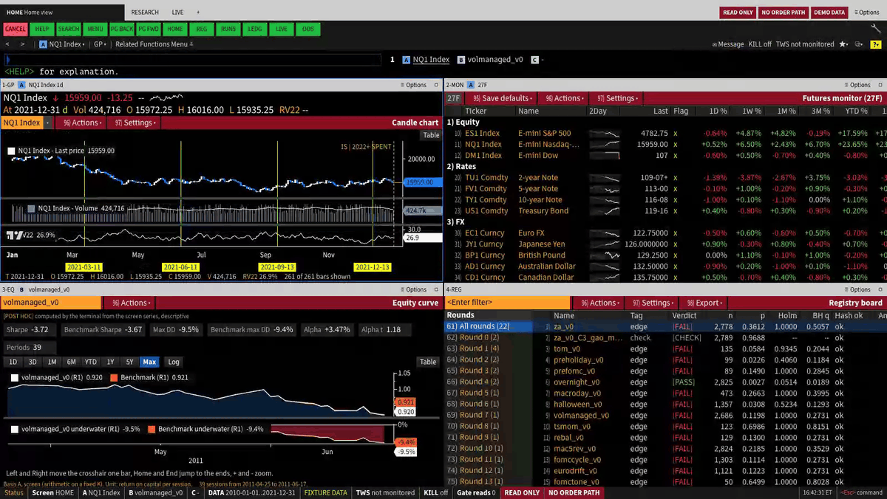</p>
<p align="center"><em>Four commands typed in demo mode: <code>REG</code>, <code>volmanaged_v0 DES</code>, <code>volmanaged_v0 RET</code>, then <code>HOME</code>.</em></p>

All images come from demo mode. The registry and multiple-testing views are the API's answers on the real research
files, captured on 2026-09-27; runs, analytics and the DES page shown here come from the fixture backend; prices are
synthetic and never pass through the gate. Click an image to open it at full size.

<table>
  <tr>
    <td width="50%" valign="top">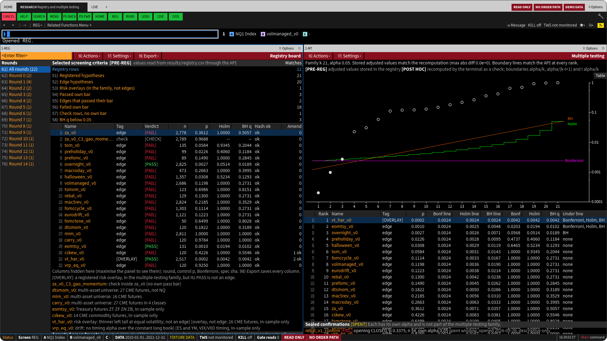<br><sub><b>REG + MT</b> · Registry board beside the multiple-testing view</sub></td>
    <td width="50%" valign="top">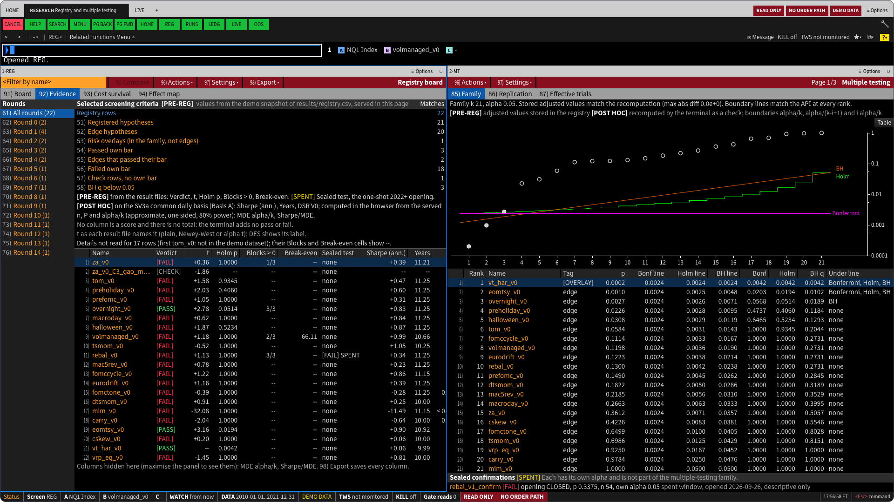<br><sub><b>REG 92) Evidence</b> · Every registry row against its recorded evidence; no score, no total</sub></td>
  </tr>
  <tr>
    <td width="50%" valign="top">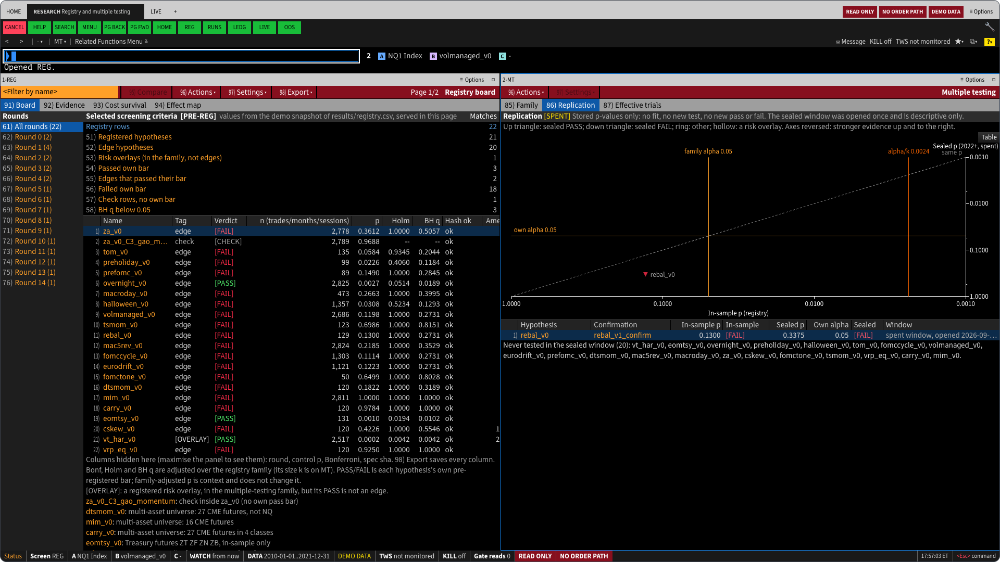<br><sub><b>MT 86) Replication</b> · A sealed confirmation's p against its parent's in-sample p</sub></td>
    <td width="50%" valign="top">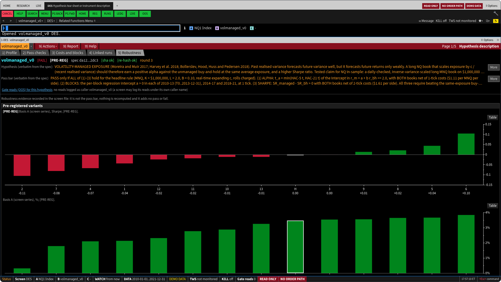<br><sub><b>volmanaged_v0 DES 5) Robustness</b> · The variants the screen file recorded; nothing is recomputed</sub></td>
  </tr>
  <tr>
    <td width="50%" valign="top">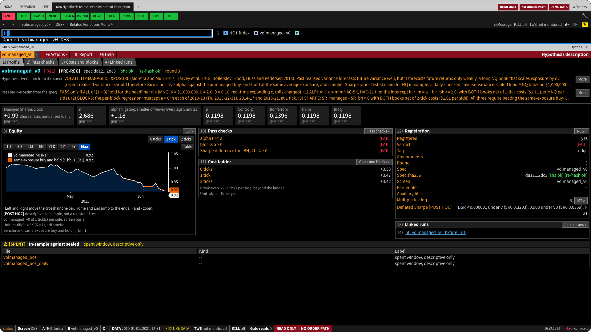<br><sub><b>volmanaged_v0 DES</b> · One hypothesis: verbatim spec, pass bar, re-hashed spec, costs and linked runs</sub></td>
    <td width="50%" valign="top">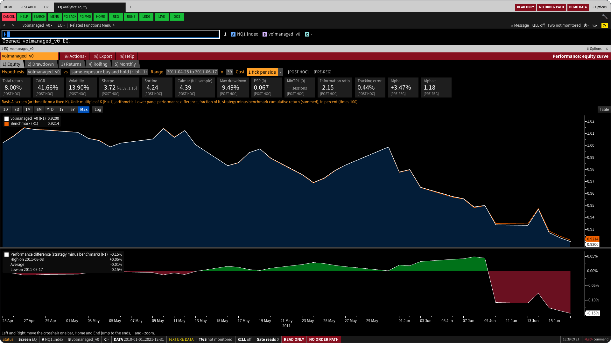<br><sub><b>volmanaged_v0 EQ</b> · Equity against its benchmark; every tile carries its tag</sub></td>
  </tr>
  <tr>
    <td width="50%" valign="top">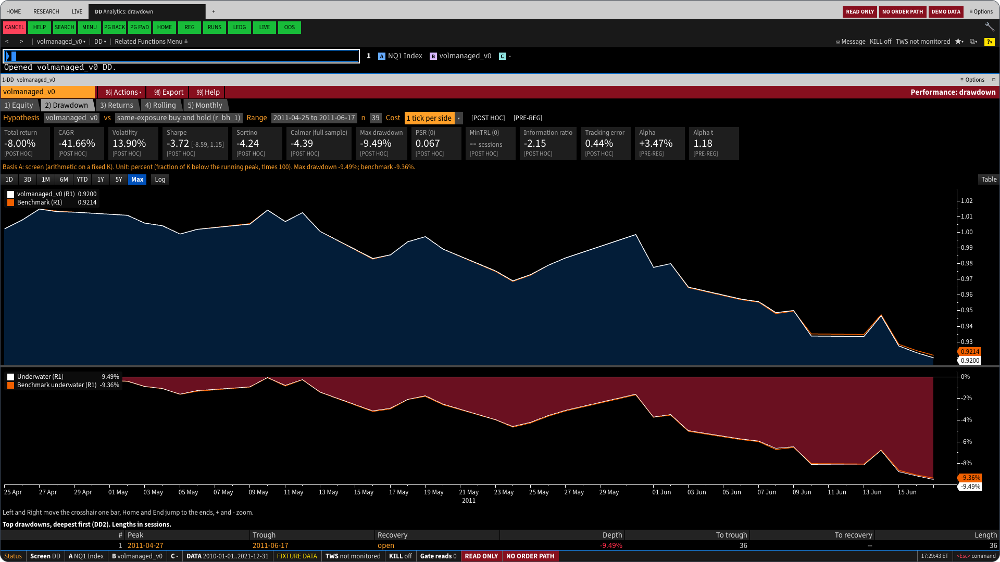<br><sub><b>volmanaged_v0 DD</b> · Equity and underwater curves against the benchmark</sub></td>
    <td width="50%" valign="top">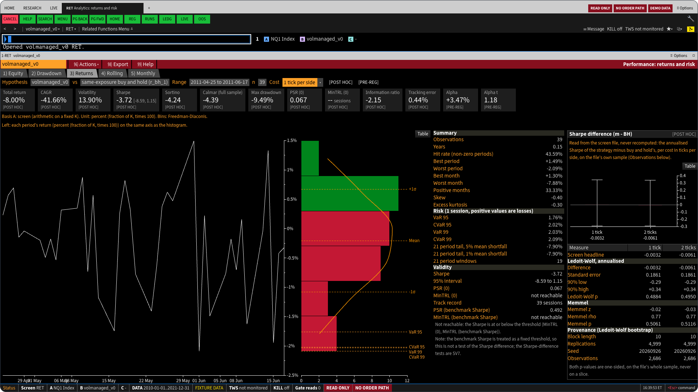<br><sub><b>volmanaged_v0 RET</b> · Returns and risk beside the Sharpe-difference test</sub></td>
  </tr>
  <tr>
    <td width="50%" valign="top">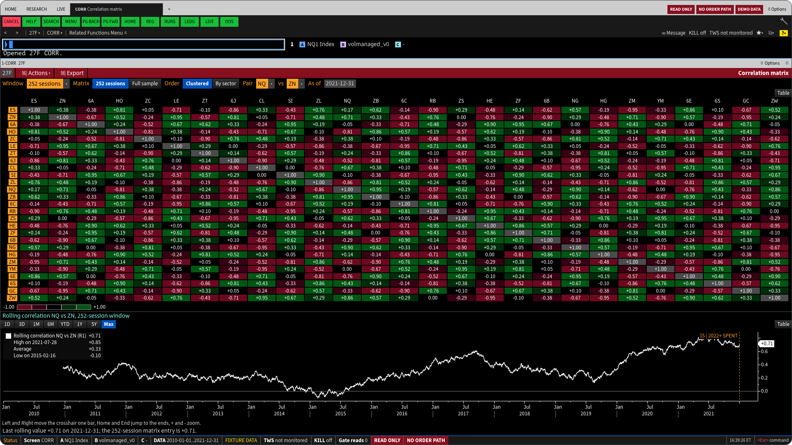<br><sub><b>27F CORR</b> · Clustered correlation matrix with a rolling pair, on seeded demo values</sub></td>
    <td width="50%" valign="top">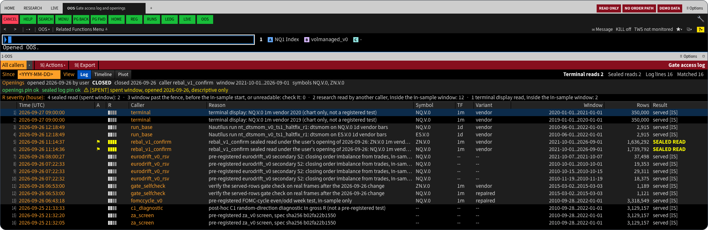<br><sub><b>OOS</b> · The gate's access log: every read by caller, sealed reads flagged</sub></td>
  </tr>
  <tr>
    <td width="50%" valign="top">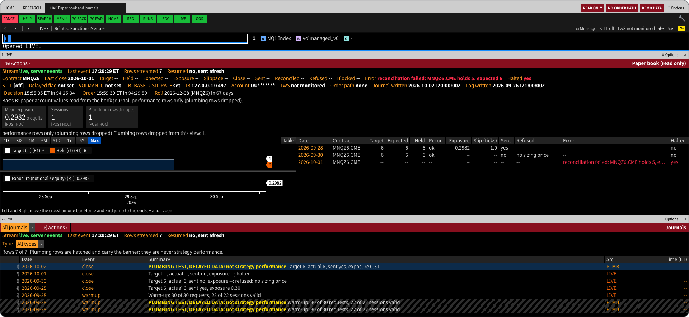<br><sub><b>LIVE + JRNL</b> · The paper book, read only, above its journals</sub></td>
    <td width="50%" valign="top">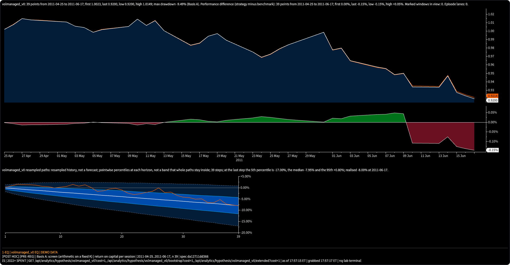<br><sub><b>GRAB</b> · The image <code>GRAB</code> saves, with a caption of basis, tag, window, source and time</sub></td>
  </tr>
</table>

The halted row on LIVE is a test fixture in the paper book's journal format. The terminal only displays journals; it
never halts, reconciles or trades anything.

<details>
<summary>What each screen holds</summary>

Numbers such as `92)` are the item numbers of a panel's views and tabs: type the number and `<GO>` to open that view.

| Screen | Views and features |
|---|---|
| `HOME` | Four linked panels: NQ1 Index daily candles, the 27-futures monitor, volmanaged_v0 equity and the registry board |
| `REG` | 91) Board, the registry by round with verdict, n, p, Holm and BH q, plus the sealed confirmations; 92) Evidence; 93) Cost survival; 94) Effect map; 95) Compare, up to eight hypotheses. Filters, CSV export and a Seen column that marks `NEW` and `CHG` rows |
| `MT` | 85) Family, sorted p against the Bonferroni, Holm and BH lines, the Deflated Sharpe view and a power table; 86) Replication; 87) Effective trials |
| `DES` | A hypothesis: Profile with the verbatim spec and the re-hashed spec, Pass checks, Costs and blocks, Linked runs and Robustness. An instrument: Profile, Coverage, Notes and Contracts |
| `RUNS`, `RUN` | Every backtest run with badges and checks and a compare basket; one run's chart, trades, fills, logs, config and notes |
| `EQ`, `DD`, `RET`, `RR`, `MRET` | The analytics tear sheet for a hypothesis (Basis A) or a run (Basis B) |
| `COST`, `BLK`, `EXPO`, `SEAL` | Cost ladder or cost waterfall; the blocks of a hypothesis; a run's exposure and turnover; the sealed-window files |
| `GP`, `GIP`, `MON`, `CORR` | Candles with roll markers and fills; one session intraday; the 27-futures monitor; the clustered correlation matrix |
| `VCONE`, `SEAS`, `EVT`, `ROLL`, `DQ` | Volatility cone, seasonality, event study around CPI, PPI, NFP and FOMC, roll calendar and data quality |
| `OOS`, `LEDG` | The gate's access log and openings; the run ledger with its anchor pairs |
| `LIVE`, `JRNL` | The paper book, read only, with its expectation cone; its journals with plumbing rows hatched. Server-sent events, or 2 s polling as a fallback |
| `HELP` | Every function with runnable examples, the keys, link groups, licences and a glossary of every label the terminal prints |

**Exports.** Most tables have `98) Export` (CSV). `GRAB` saves a panel's charts as one PNG with a caption, and on DES
and the tear sheet the Options menu also makes an HTML evidence pack and a print dossier. All are built from answers
already in the browser: they make no request and recompute nothing, and the DEMO DATA flag travels with a demo export.

</details>

## Keyboard first

The command line reads `[NXTW] [context [SECTOR]] [FUNCTION [args]] [HELP] <GO>`. The context is an instrument (one
of the 27 futures, or a generic ticker such as `NQ1`), a hypothesis, a run id, or `27F` for the universe. Examples:
`NQ GP`, `volmanaged_v0 DES`, `27F CORR`, `REG`, `GP HELP`.

| Key | Action |
|---|---|
| <kbd>Enter</kbd> | `<GO>`: run the command line |
| <kbd>Shift</kbd>+<kbd>Enter</kbd> | Open the result in a new panel, the same as `NXTW` before the command |
| <kbd>Esc</kbd> | CANCEL: close the open list or menu; else clear the typed line; else return to the panel |
| <kbd>F1</kbd> | HELP for the focused screen or the typed function; twice quickly opens the HELP index |
| <kbd>F8</kbd> to <kbd>F11</kbd> | Insert a sector key: Equity, Comdty, Index, Curncy |
| <kbd>End</kbd> / <kbd>Shift</kbd>+<kbd>End</kbd> | BACK and FORWARD in the focused panel |
| <kbd>Home</kbd> | Focus the command line from anywhere else |
| <kbd>PgUp</kbd> / <kbd>PgDn</kbd> | Page back and forward; a number first (`3` <kbd>PgDn</kbd>) jumps that many pages |
| <kbd>Shift</kbd>+<kbd>PgUp</kbd> / <kbd>PgDn</kbd> | Walk the command history |
| <kbd>Alt</kbd>+<kbd>1</kbd> to <kbd>9</kbd> | Focus panel 1 to 9 |
| <kbd>Ctrl</kbd>+<kbd>K</kbd> | Focus the command line and select its text |
| <kbd>Alt</kbd>+<kbd>K</kbd> | Show or hide the key map |
| `N` <kbd>Enter</kbd> | Run numbered item N of the focused panel |
| Chart focused | <kbd>Left</kbd> / <kbd>Right</kbd> step the crosshair, <kbd>+</kbd> / <kbd>-</kbd> zoom, <kbd>T</kbd> toggles the table view |

Panels in link group A, B or C share one context: setting it in one panel retargets every panel of the group and syncs
their time crosshair.

<p align="center">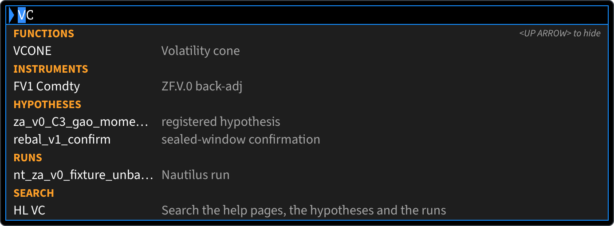</p>
<p align="center"><em>Suggestions group functions, instruments, hypotheses and runs as you type.</em></p>

<p align="center">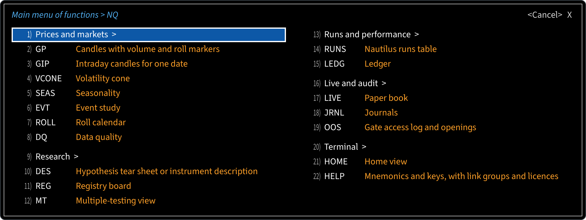</p>
<p align="center"><em>MENU lists related functions, numbered; type the number and <code>&lt;GO&gt;</code>.</em></p>

**Command words.** Besides the mnemonics, the command line knows a few words that change the terminal and never the
research: `HL text` (search), `MENU`, `LAST` (the last 8 commands), `MAIN`, `NO` (event tape on or off), `RESET` (put
the screen's layout back), `UNDO` (the last 10 layout changes), `WATCH` (what changed in the research records since you
marked them seen), `GRAB` (save the panel as an image), `SAVE NAME`, `LOAD NAME` and `FORGET NAME` (named workspaces,
at most 12).

**Links.** A panel's Options menu has Copy link. A link is `#go=<line>` in the address bar, replayed through the
command line when the page opens and then cleared. Links open screens, contexts and help only: the command words above,
numbers and `HL` never run from a URL, and a link with any other line is refused whole.

<details>
<summary>All 30 mnemonics</summary>

From [`web/src/commands/registry.ts`](web/src/commands/registry.ts), in HELP's order. P0 shipped first, P1 after it,
and P2 (`JOBS`) with the owner's approval of 2026-10-01.

| No. | Mnemonic | Screen | Context | Pri |
|---:|---|---|---|---|
| 1 | `HOME` | Home view | none | P0 |
| 2 | `GP` | Candles with volume and roll markers | instrument, optional timeframe `1m`, `5m`, `1h` or `1d` | P0 |
| 3 | `GIP` | Intraday candles for one date | instrument, then a date | P0 |
| 4 | `DES` | Hypothesis tear sheet or instrument description | hypothesis or instrument | P0 |
| 5 | `REG` | Registry board | none | P0 |
| 6 | `MT` | Multiple-testing view | none | P0 |
| 7 | `RUNS` | Nautilus runs table | none | P0 |
| 8 | `RUN` | Run inspector | run | P0 |
| 9 | `EQ` | Analytics: equity | run or hypothesis | P0 |
| 10 | `DD` | Analytics: drawdown | run or hypothesis | P0 |
| 11 | `RET` | Analytics: returns and risk | run or hypothesis | P0 |
| 12 | `RR` | Analytics: rolling statistics | run or hypothesis | P0 |
| 13 | `MRET` | Analytics: monthly returns | run or hypothesis | P0 |
| 14 | `MON` | 27-futures monitor | `27F` | P0 |
| 15 | `CORR` | Correlation matrix | `27F` | P0 |
| 16 | `LEDG` | Ledger | none | P0 |
| 17 | `OOS` | Gate access log and openings | none | P0 |
| 18 | `LIVE` | Paper book | none | P0 |
| 19 | `JRNL` | Journals | none | P0 |
| 20 | `HELP` | Mnemonics and keys, with link groups and licences | none | P0 |
| 21 | `COST` | Cost ladder | run or hypothesis | P1 |
| 22 | `BLK` | Blocks | hypothesis | P1 |
| 23 | `EXPO` | Exposure | run | P1 |
| 24 | `SEAL` | Sealed results | hypothesis | P1 |
| 25 | `VCONE` | Volatility cone | instrument | P1 |
| 26 | `SEAS` | Seasonality | instrument or hypothesis | P1 |
| 27 | `EVT` | Event study | instrument | P1 |
| 28 | `ROLL` | Roll calendar | instrument | P1 |
| 29 | `DQ` | Data quality | instrument | P1 |
| 30 | `JOBS` | Backtest queue | none | P2 |

</details>

## How it is built

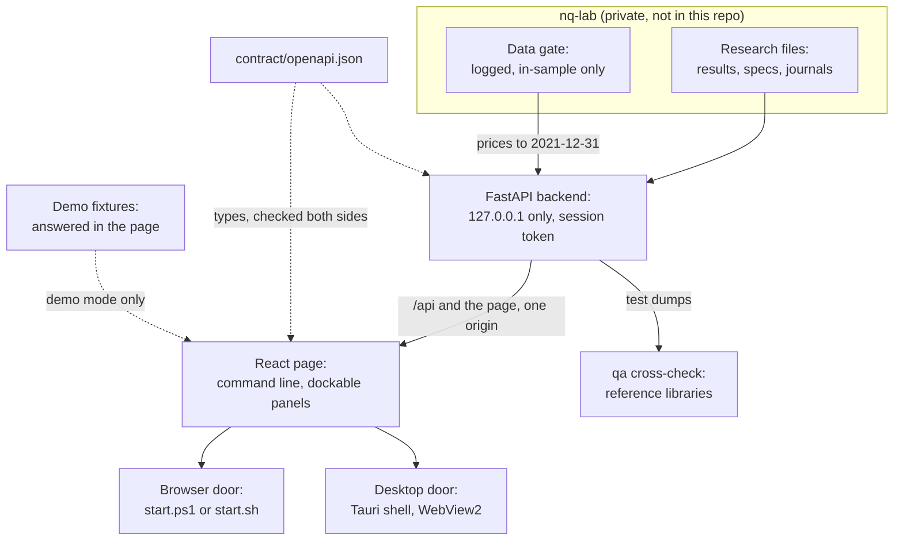

- **Backend.** FastAPI on uvicorn, package `nq_terminal` in [`backend/`](backend), run in the nq-lab virtual
  environment. It binds 127.0.0.1, refuses every `/api` request without a live session, and serves the built page and
  `/api` from one origin. One backend runs per lab, guarded by a lock file and a challenge-response handshake.
- **The data gate.** Every price read goes through nq-lab's `nq_lab.data.serve` with caller `terminal`, so the gate
  decides and logs each read and serves nothing after 2021-12-31. Prices are cached in memory only, never on disk.
- **Contract.** [`contract/openapi.json`](contract/openapi.json) holds 84 paths. pytest compares the app with it, and
  `pnpm gen:api` generates the page's types from it; `pnpm test` fails first when they have drifted.
- **Web page.** React 19.3.0, TypeScript 6.0.3 and Vite 8.3.1, with dockview panels under a cmdk command line, zustand
  and TanStack Query. Charts use uPlot, TradingView Lightweight Charts and Apache ECharts; grids use TanStack Table and
  Perspective pivots. One GET client ([`web/src/api/client.ts`](web/src/api/client.ts)) makes every request.
- **Desktop shell.** A Tauri 2 app in Rust ([`desktop/`](desktop/README.md)) that opens one window over the page and
  gives the page no shell command. It starts the lab's backend in a Windows Job Object, holds the session token itself
  and keeps its WebView2 profile and settings outside the lab.
- **qa.** A separate uv project ([`qa/`](qa)) that recomputes the dumped analytics with reference libraries and never
  imports the backend.

[`web/scripts/bundleCheck.ts`](web/scripts/bundleCheck.ts) runs after every `pnpm build` and fails a build that goes
over its per-chunk gzip budget or loads a chart or grid library with the shell. The full stack, folder layout,
endpoint index and design decisions are in [`docs/ARCHITECTURE.md`](docs/ARCHITECTURE.md) and section 7 of
[`docs/PRD.md`](docs/PRD.md).

<details>
<summary>Bundle budgets</summary>

| Chunk, gzip | Budget | Measured 2026-10-02 |
|---|---:|---:|
| Shell (index, React, vendor, runtime, preload, commands, sectors) | 114.9 kB | 109.5 kB |
| uPlot | 30.0 kB | 22.1 kB |
| Lightweight Charts | 75.0 kB | 61.4 kB |
| ECharts | 230.0 kB | 201.6 kB |
| TanStack grid | 45.0 kB | 18.7 kB |
| Perspective | 100.0 kB | 86.1 kB |

`web/scripts/shellBudget.test.ts` pins the shell ceiling. Raise a ceiling only in the change that needs the room, and say
why.

</details>

## Safety model

nq-lab's research rules bind the backend, and the terminal is built so that it cannot break them.

<p align="center"></p>
<p align="center"><em>The status line on every screen: the served window, the data source, gate reads, READ ONLY and NO ORDER PATH.</em></p>

- **Read only.** A test pins the route set to GET plus the four writes and fails on anything else. A syntax-tree scan
  bans write calls anywhere in the backend. The ledger is never written: for an eligible run, `RUN` shows the command
  for you to copy and run yourself. Tests: [`test_app.py`](backend/tests/test_app.py),
  [`test_safety_ast.py`](backend/tests/test_safety_ast.py).
- **One door to prices.** Every price read goes through the gate; the sealed door is never called, and the same scan
  bans direct parquet reads.
- **No order path.** The one IB client is opt-in, paper only and read only: it can send eight read-only message kinds,
  and its order-style calls raise. A scan bans IB order calls across the terminal, and the browser tests assert that no
  route or component is named like an order action. Tests: [`test_safety_ast.py`](backend/tests/test_safety_ast.py),
  [`safety.spec.ts`](web/e2e/flows/safety.spec.ts).
- **Local only.** The server binds 127.0.0.1 in code, refuses a peer that is not loopback, accepts only the hosts
  127.0.0.1 and localhost, has no CORS, and sends a strict content security policy that refuses framing. Tests:
  [`test_app.py`](backend/tests/test_app.py), [`test_csp_wasm.py`](backend/tests/test_csp_wasm.py).
- **Links cannot act.** A `#go=` link is untrusted input: capped, held to the command alphabet, and limited to opening
  screens, contexts and help.
- **No private data out.** Error bodies and served files carry no local paths, account ids are masked, and environment
  values are reported only as set or unset.
- **Tests leave the research alone.** During the backend tests an audit hook refuses any write under the research
  folders, and a session fixture hashes the audit log, ledger, registry and openings before and after. Tests:
  [`research_guard.py`](backend/tests/research_guard.py), [`test_research_guard.py`](backend/tests/test_research_guard.py).

## Testing and quality gates

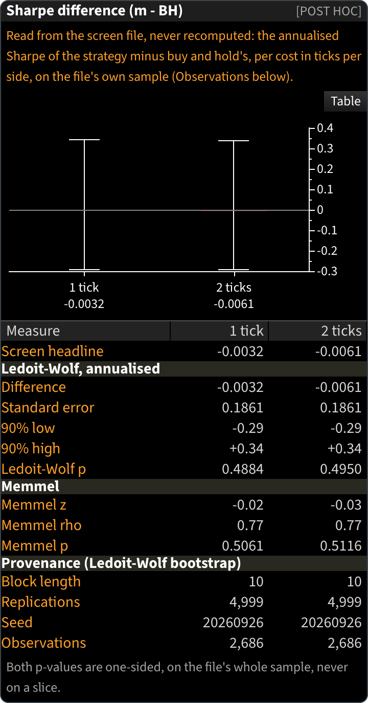

**Three implementations.** The terminal's own numpy and pandas functions produce every number the API serves.
Nautilus statistics are the second implementation, inside the backend tests. The `qa` project's reference libraries
(quantstats, empyrical-reloaded, arch and statsmodels) are the third and recompute every value the backend tests
dump. Nautilus's own alpha and tear sheet never produce a displayed number, because they zero-fill weekends and
annualise geometrically. Every chart names its return basis and unit.

**The catalogue.** [`docs/ANALYTICS_CATALOG.md`](docs/ANALYTICS_CATALOG.md) lists 79 metrics (41 P0, 31 P1, 7 P2), from
performance and drawdowns to research integrity and live paper monitoring.

**Latest full run.** The release records of the 0.2.1 tree (5 October 2026) read: backend 4,377 passed, crosscheck strict
PASS 2,495, FAIL 0, smoke 18 and smoke-app 5 passed, QA 333 passed, the install test on a renamed-product build 54 of
54 and the upgrade from 0.2.0 to 0.2.1 on a renamed-product build 105 of 105 (the owner's real install unchanged), and
`release_check.ps1 -Tag desktop-v0.2.1 -RequireSmokeApp -RequireInstall` PASS with no WARN ([hand-over](docs/desktop/handover_windows.md),
section 7). The release records of the 0.2.0 tree read: backend 4,357 passed, crosscheck PASS 2,495, FAIL 0, install
54 of 54 and upgrade 105 of 105. The release records of the 0.1.2 tree read: backend 4,201 passed, crosscheck PASS 2,495, FAIL 0, install
54 of 54 and upgrade 105 of 105. The suites of the 0.1.1
tree read: backend 4,155 passed, crosscheck strict PASS 2,495, FAIL 0, QA 333 passed, vitest 7,394 passed (47 skipped),
Playwright e2e 539 passed, offline 190 (3 declared skips), desktop 42, perf 3 and `check.ps1` 29 of 29 ([G2
results](docs/desktop/g2_windows/results.md), section A6).

<br clear="right">

From the `nq-lab` folder, in PowerShell:

```powershell
# Backend (it also writes the JSON dumps the cross-check reads)
& .venv\Scripts\python.exe -m pytest -p no:warnings -o addopts="" -q terminal\backend\tests

# Independent cross-check: its own tests, then every dumped value against the reference libraries
uv run --project terminal\qa python -m pytest -q terminal\qa\tests
uv run --project terminal\qa python -m crosscheck --strict

# Front end: the contract check with vitest, the type check, a production build, then Playwright with axe
pnpm --dir terminal\web test
pnpm --dir terminal\web test:types
pnpm --dir terminal\web build
pnpm --dir terminal\web e2e
pnpm --dir terminal\web e2e:perf
```

The Playwright tests start their own fixture backend and preview server on spare loopback ports and never reach the
research files. The first run on a new machine needs the browser:
`pnpm --dir terminal\web exec playwright install chromium`.

**Desktop and release gates.** From the terminal folder (`desktop\README.md` has the details):

```powershell
powershell -NoProfile -File desktop\scripts\check.ps1
uv run --project qa python -m crosscheck.served
powershell -NoProfile -File scripts\smoke_real.ps1 -Mode App
powershell -NoProfile -File scripts\record_green.ps1 -Check backend
powershell -NoProfile -File scripts\release_check.ps1 -Tag desktop-vX.Y.Z -RequireSmokeApp
```

`corepack pnpm e2e:desktop`, run from the `web` folder, drives the desktop Playwright project against the hidden smoke
build. `record_green.ps1` writes a dated record for each check (`backend`, `crosscheck`, `smoke`, `smoke-app`), and
`release_check.ps1` refuses a tag unless today's records, the artefacts and a clean commit all describe the same tree.
It never creates the tag. The full release procedure is section 7 of the
[hand-over](docs/desktop/handover_windows.md).

<details>
<summary>Test it on macOS or Linux (no nq-lab needed)</summary>

From the repository folder, with Node 24:

```sh
corepack pnpm --dir web test
corepack pnpm --dir web test:types
corepack pnpm --dir web build
corepack pnpm --dir web build:gallery
corepack pnpm --dir web build:demo
```

The offline Playwright suite runs the Windows specs against the demo layer, served as `GET /api/*` from Node, so it
needs no Python and no backend:

```sh
corepack pnpm --dir web e2e:offline:baseline
corepack pnpm --dir web e2e:offline
corepack pnpm --dir web e2e:offline:perf
```

`e2e:offline:baseline` writes this machine's screenshot baselines once (git-ignored); `e2e:offline` then compares
against them. A few tests whose data the demo dataset does not hold are skipped by name, and each says why;
[`docs/TESTING.md`](docs/TESTING.md) lists them.

Two tests assume the nq-lab layout and fail outside it: `web/src/grids/JournalTable.model.test.ts` reads nq-lab's
`src/nq_lab/paper_plumbing.py`, and qa's `test_the_default_dump_folder_is_under_terminal_qa` expects the qa folder's
parent to be named `terminal`.

</details>

**Docs are tested too.** `web/scripts/docsSync.test.ts` fails when this README names a `pnpm` script that
`web/package.json` lacks, links a file that does not exist, quotes a version the package does not pin or lists the
mnemonics out of step with the registry. User-facing text lives in `web/src/copy/`, where a test checks every module
for em and en dashes and US spellings.

## Documentation

| Document | What it covers |
|---|---|
| [`docs/PRD.md`](docs/PRD.md) | What the terminal is for, its scope by priority, the non-goals and the decision log |
| [`docs/ARCHITECTURE.md`](docs/ARCHITECTURE.md) | Stack and versions, folder layout, data contracts, the endpoint index of all 84 paths, the gate, security, run and test commands |
| [`docs/UI_SPEC.md`](docs/UI_SPEC.md) | The frame, design tokens, command line and keys, honesty labels, screens, components and copy rules |
| [`docs/BLOOMBERG_LOOK.md`](docs/BLOOMBERG_LOOK.md) | The look and behaviour spec: palette, type, chrome, keyboard, charts and screens |
| [`docs/ANALYTICS_CATALOG.md`](docs/ANALYTICS_CATALOG.md) | Every metric with its priority, definition, inputs and QA reference |
| [`docs/research_launcher.md`](docs/research_launcher.md) | Starting a backtest from LEDG or RUN, the job indicator, anchor re-runs and what they will not do |
| [`docs/TESTING.md`](docs/TESTING.md) | Which suites run where, the session token in tests, and what the offline suite skips |
| [`docs/media/README.md`](docs/media/README.md) | Where each image on this page came from and how it was captured |
| [`docs/desktop/README.md`](docs/desktop/README.md) | Index of the desktop documents, in reading order, with the build status |
| [`docs/desktop/handover_windows.md`](docs/desktop/handover_windows.md) | Install, run, update, roll back, the permission runbook, the release procedure and troubleshooting |
| [`docs/desktop/smartscreen.md`](docs/desktop/smartscreen.md) | SmartScreen and Smart App Control with the unsigned installer, hash checks and signing options |
| [`docs/desktop/g2_windows/verdict.md`](docs/desktop/g2_windows/verdict.md) | The G2 verdict for the Windows app; measurements in [`results.md`](docs/desktop/g2_windows/results.md) |
| [`docs/desktop/owner_decisions_windows.md`](docs/desktop/owner_decisions_windows.md) | The owner's decisions for the Windows app, open and closed |
| [`docs/desktop/checks/README.md`](docs/desktop/checks/README.md) | Templates for the owner-run checks |
| [`docs/desktop/02_decision.md`](docs/desktop/02_decision.md), [`03_migration_plan.md`](docs/desktop/03_migration_plan.md), [`04_roadmap.md`](docs/desktop/04_roadmap.md), [`05_risks_costs.md`](docs/desktop/05_risks_costs.md) | Why Tauri, how the desktop build was planned, the phases and the risk register |
| [`desktop/README.md`](desktop/README.md) | The shell's layout, build identities, modules, static bans and checks |
| [`desktop/harness/README.md`](desktop/harness/README.md) | The G2 measurement harness |

<details>
<summary>Repository layout</summary>

| Path | What it holds |
|---|---|
| `backend/` | The FastAPI package `nq_terminal` and its tests |
| `web/` | The page (React on Vite, in TypeScript). Demo mode is in `web/src/demo/`, the launcher in `web/scripts/start/`, the Playwright specs in `web/e2e/` |
| `qa/` | The independent cross-check; `qa/golden/` holds the reference values the browser-side formulas are pinned to |
| `contract/openapi.json` | The API contract; both sides test that they match it |
| `desktop/` | The Windows shell (a Tauri crate in `src-tauri/`), its check and release scripts and the G2 harness |
| `docs/` | The design notes and the desktop documents. The build log, `TASKS.md`, is kept local and is not in the repository |
| `scripts/` | The macOS and Linux launcher entry (`scripts/start.mjs`), the real-data smoke, the green records and the release check |
| `start.ps1`, `start.sh` | The start commands for Windows, and for macOS and Linux |

</details>

## Contributing

Contributions are welcome. This is one person's research tool, so every change is reviewed by a single maintainer
([@FatihHekim0glu](https://github.com/FatihHekim0glu)) and may take a while. Please open an issue before a large change.
Read [`CONTRIBUTING.md`](CONTRIBUTING.md) before you start. Changes that add an order path,
a broker connection or a way past the data gate will not be accepted.

## Code of conduct

Everyone taking part is expected to follow the [code of conduct](CODE_OF_CONDUCT.md).

## Security

Please do not report a security problem in a public issue. Use private vulnerability reporting under this repository's
**Security** tab instead. [`SECURITY.md`](SECURITY.md) has the details. For anything else,
open a [GitHub issue](https://github.com/FatihHekim0glu/nq-terminal/issues).

## Accessibility

The target is WCAG 2.2 AA. [`contrast.test.ts`](web/src/theme/contrast.test.ts) holds every text pair at 4.5:1 and every
graphic pair at 3:1, in the default theme and both colour-vision-deficiency themes; every canvas chart carries a data
summary and a table view, and the Windows Playwright suite runs axe scans over every mnemonic. Screen-reader passes with NVDA and
Narrator on the desktop app are still owner checks to come. [`ACCESSIBILITY.md`](ACCESSIBILITY.md) has the full
statement.

## Licence

See [LICENSE](LICENSE).

## Credits

Built for research on [NautilusTrader](https://github.com/nautechsystems/nautilus_trader) 1.231.0, which nq-lab uses
as a library, unmodified. The UI stands on dockview, uPlot, TradingView Lightweight Charts, Apache ECharts, TanStack
(Table, Virtual, Query), Perspective, cmdk and zustand; the desktop shell on Tauri. The fonts are Bergoom, Source Sans
3 and PT Mono, under the SIL Open Font Licence 1.1 and self-hosted.

Candlestick charts use TradingView Lightweight Charts (Apache-2.0); the TradingView attribution logo stays on every
candle chart.

> TradingView Lightweight Charts™\
> Copyright (с) 2025 TradingView, Inc. [https://www.tradingview.com/](https://www.tradingview.com/)

Not affiliated with or endorsed by Bloomberg L.P.; Bloomberg and Bloomberg Terminal are trademarks of Bloomberg
Finance L.P.
