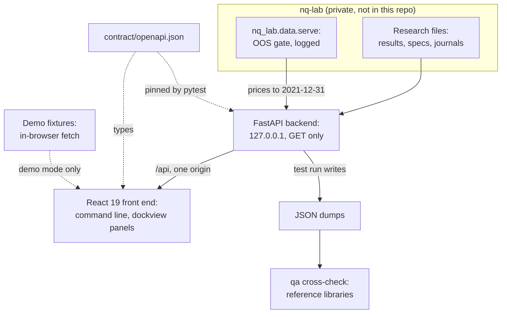

<h1 align="center"></h1>

<p align="center">
  <a href="#try-the-demo">Try the demo</a> ·
  <a href="#screens">Screens</a> ·
  <a href="#keyboard-first">Keyboard</a> ·
  <a href="#start-it-on-macos-or-linux">macOS and Linux</a> ·
  <a href="#full-setup-with-nq-lab">Full setup</a> ·
  <a href="#architecture">Architecture</a> ·
  <a href="#safety-model">Safety model</a> ·
  <a href="#analytics-and-qa">Analytics and QA</a>
</p>

<p align="center">
  <a href="#safety-model"></a>
  <a href="#try-the-demo"></a>
  <a href="#architecture"></a>
  <a href="#architecture"></a>
</p>

<p align="center">
  
</p>
<p align="center"><em>HOME in demo mode: candles, the 27-futures monitor, a hypothesis equity curve and the registry board, linked by groups A and B. Demo prices are synthetic; every screen carries the DEMO DATA flag.</em></p>

**nq-terminal**, the research terminal for nq-lab, runs on your machine and reads nq-lab's NautilusTrader research on
NQ futures. One keyboard-driven screen shows the pre-registered hypotheses, the backtest runs and their analytics, the
out-of-sample audit trail, the sealed results and the IB paper book's journals. The look is a dense, flat-black
terminal: amber on black, function keys, a command line.

> [!IMPORTANT]
> The terminal never places, modifies or cancels an order. It has no order path, and tests fail if one appears.

## Highlights

- **Read only by construction.** All 74 API paths are GET, bar the two writes of the `JOBS` backtest queue (`POST /api/jobs` and
  `DELETE /api/jobs/{job_id}`), and tests fail on any other method or on a write call in the backend. See the
  [safety model](#safety-model).
- **No order path.** The one IB client is read only (an optional paper snapshot on client id 95), and tests fail on an
  IB order call or on any route or component named like an order action.
- **One gated door to prices.** Every price read goes through nq-lab's out-of-sample gate, which decides and logs it.
  Nothing after 2021-12-31 is served.
- **Honest labels.** `[PRE-REG]` marks a value read from a registered result and `[POST HOC]` one the terminal
  computed. Sealed windows show as spent. The terminal adds no pass or fail of its own.
- **Keyboard first.** 30 mnemonics on a command line drive dockable panels that link by group and share a time
  crosshair; `HL` searches functions, metrics, instruments and help text. See [Keyboard first](#keyboard-first).
- **A layout you can get back.** `RESET` puts a screen's layout back and `UNDO` restores yours (the last 10 changes);
  `SAVE`, `LOAD` and `FORGET` keep named workspaces; a `#go=` link reopens a view.
- **Exports keep their labels.** `GRAB` saves a panel as an image with its basis, unit, tag and source in the caption;
  DES and the tear sheet also make an HTML evidence pack and a print dossier, from the answers already on screen.
- **Notices what changed.** `WATCH` and a `NEW` or `CHG` mark on REG, RUNS and LEDG show which research records are new
  or were rewritten since you last looked; a connection strip says when the backend stops answering.
- **Three implementations of the headline metrics.** The terminal's own functions, Nautilus statistics and
  reference libraries must agree. See [Analytics and QA](#analytics-and-qa).
- **Accessible.** The target is WCAG 2.2 AA. [`contrast.test.ts`](web/src/theme/contrast.test.ts) holds every text
  pair at 4.5:1 and every graphic pair at 3:1, in the default theme and both colour-vision-deficiency themes. Every
  canvas chart carries a data summary and a table view.

## Try the demo

The first quick start needs no backend and no nq-lab. You need Node 24 (`web/.nvmrc` says 24, `engines` in
`web/package.json` asks for 24 or later, and `web/pnpm-workspace.yaml` sets `engineStrict: true`) and pnpm 11 through
corepack, which may ask once to download pnpm 11.5.1.

On macOS or Linux, from the repository folder:

```sh
./start.sh --demo
```

On any system, including Windows:

```sh
corepack pnpm --dir web install
corepack pnpm --dir web demo
```

Open http://127.0.0.1:5174. The terminal opens on HOME, with DEMO DATA in the frame strip and on the
status line. `./start.sh --demo` installs the web dependencies when they are missing and opens the browser itself;
`./start.sh doctor` says what a plain start would do on your machine (see [Start it on macOS or
Linux](#start-it-on-macos-or-linux)).

## Demo mode

Demo mode runs the whole terminal in the browser on fixture data. Before the terminal renders, the demo replaces the
page's fetch and EventSource: it answers `/api` inside the page and refuses any request that is not a GET and any
other origin, including a real backend on 127.0.0.1:8765. Nothing is sent to a backend.

> [!NOTE]
> DEMO DATA marks all of it: registry records captured from the real research files, hypothesis pages from those files
> and from the fixture backend, the fixture backend's runs and analytics, synthetic prices that never pass through the
> gate, and market views (`MON`, `CORR`, `VCONE`, `SEAS`, `EVT`) that are seeded or hand-built fillers on the backend's
> scale, not statistics of real prices. LIVE and JRNL replay a recorded journal through an in-page event stream. FIXTURE
> DATA is the same warning for a real backend that reads the fixture folder; the two are never shown together.

- **What is captured and what is not.** In the demo, `HELP <GO>` opens with About this demo, which says which answers
  are captured, which are synthetic and which are gaps. The route table is
  [`web/src/demo/routes.ts`](web/src/demo/routes.ts): one handler per contract path, typed so that a missing path
  fails the compile.
- **Gaps say so.** A path, run or request the demo holds no honest body for answers "not in the demo dataset", and
  the screen shows that text. It is a gap in the demo, not a fault and not a finding. (`JOBS` and the IB snapshot
  answer as a server with both off.)
- **GET only.** The demo refuses any other method in the page, before anything else looks at the request.
- **No demo code in a production build.** [`bundleCheck.ts`](web/scripts/bundleCheck.ts) fails a production build that
  contains demo code, and fails a demo build that lacks it.
- **Not for publishing.** A built demo bundle carries snapshots of real research files. It is for your own machine.

<details>
<summary>Build a static demo bundle</summary>

```sh
corepack pnpm --dir web build:demo
```

This writes `web/dist-demo` (git-ignored) and runs the bundle check with `--demo`.

</details>

## Walkthrough

<p align="center"></p>
<p align="center"><em>Four commands typed at the command line in demo mode: <code>REG</code>, <code>volmanaged_v0 DES</code>, <code>volmanaged_v0 RET</code>, then <code>HOME</code>. 15 s loop.</em></p>

## Screens

All images come from demo mode. The registry and multiple-testing views are the API's answers on the real research
files, captured on 2026-09-27. The DES pages mix real answers with the fixture backend's; volmanaged_v0's, shown
here, is the fixture backend's. Run and analytics bodies come from the fixture backend. Prices are synthetic, from a
seeded generator, and never pass through the gate, and the market views (`MON`, `CORR`, `VCONE`, `SEAS`, `EVT`) are
seeded or hand-built fillers on the backend's scale, not statistics of real prices.

Nine of the twelve images keep the full 1920x1080 viewport, so the DEMO DATA flag and the status line stay in
frame. OOS and LIVE + JRNL are cropped to their filled upper part, which keeps the DEMO DATA flag. The last image is
not a screen: it is the file `GRAB` saves, at its own size. Click an image to open it at full size.

<table>
  <tr>
    <td width="50%" valign="top"><br><sub><b>REG + MT</b> · Registry board beside the multiple-testing view</sub></td>
    <td width="50%" valign="top"><br><sub><b>REG 92) Evidence</b> · Every registry row against its recorded evidence; no score, no total</sub></td>
  </tr>
  <tr>
    <td width="50%" valign="top"><br><sub><b>MT 86) Replication</b> · A sealed confirmation's p against its parent's in-sample p; stored numbers only</sub></td>
    <td width="50%" valign="top"><br><sub><b>volmanaged_v0 DES 5) Robustness</b> · The variants the screen file recorded; nothing is recomputed</sub></td>
  </tr>
  <tr>
    <td width="50%" valign="top"><br><sub><b>volmanaged_v0 DES</b> · One hypothesis: verbatim spec, pass bar, re-hashed spec, costs and linked runs</sub></td>
    <td width="50%" valign="top"><br><sub><b>volmanaged_v0 EQ</b> · Equity against its benchmark; every tile carries its tag, and its popover names the basis and unit</sub></td>
  </tr>
  <tr>
    <td width="50%" valign="top"><br><sub><b>volmanaged_v0 DD</b> · Drawdown: equity and underwater curves against the benchmark, deepest drawdowns listed</sub></td>
    <td width="50%" valign="top"><br><sub><b>volmanaged_v0 RET</b> · Returns and risk: VaR, CVaR, PSR and MinTRL beside the Sharpe-difference test</sub></td>
  </tr>
  <tr>
    <td width="50%" valign="top"><br><sub><b>27F CORR</b> · Clustered correlation matrix with a rolling pair, on seeded demo values</sub></td>
    <td width="50%" valign="top"><br><sub><b>OOS</b> · The gate's access log: every read by caller, sealed reads flagged</sub></td>
  </tr>
  <tr>
    <td width="50%" valign="top"><br><sub><b>LIVE + JRNL</b> · The paper book, read only, above its journals; plumbing rows never feed performance</sub></td>
    <td width="50%" valign="top"><br><sub><b>GRAB</b> · The image <code>GRAB</code> saves for a panel: the charts with a caption of basis, tag, window, source and time</sub></td>
  </tr>
</table>

The halted row on LIVE is a test fixture in the paper book's journal format. The terminal only displays journals; it
never halts, reconciles or trades anything.

**Exports.** Most tables have `98) Export`, which saves the table on screen as CSV. `GRAB <GO>`, or Grab as image in a
panel's Options, saves the panel's charts as one PNG whose caption names the panel, the basis and tag line, the window,
the `GET` paths the answer came from and the time; Copy image puts the same picture on the clipboard. On DES and the
tear sheet, Options also has Evidence pack (HTML), one file with the key figures and tables, the charts as shown and
their sources, and Print dossier, which opens the browser's print dialog (choose Save as PDF). All of them are built
from answers already in the browser. They make no request and recompute nothing, so a tear sheet has to be open
before a dossier can include it, and the DEMO DATA flag travels with a demo export.

<details>
<summary>What each screen holds</summary>

Numbers such as `92)` are the item numbers of a panel's views and tabs: type the number and `<GO>` to open that view.

| Screen | Views and features |
|---|---|
| `HOME` | Four linked panels: NQ1 Index daily candles, the 27-futures monitor, volmanaged_v0 equity and the registry board. A one-line orientation tells a first visit where to begin |
| `REG` | 91) Board, the registry by round with verdict, n, p, Holm and BH q, plus the sealed confirmations; 92) Evidence, every row against its recorded evidence (`[PRE-REG]` columns from the result files, `[POST HOC]` columns computed in the browser); 93) Cost survival, one cost ladder per hypothesis on its own scale; 94) Effect map, annual Sharpe against track length for every trial, marked by verdict; 95) Compare, up to eight hypotheses marked with Space, their screen series drawn together. Filters, CSV export, and a Seen column that marks `NEW` and `CHG` rows |
| `MT` | 85) Family, sorted p against the Bonferroni, Holm and BH lines, the adjusted table, the Deflated Sharpe view and a power table (the smallest annual Sharpe each registered test can detect); 86) Replication, each sealed confirmation's p against its parent's registered p; 87) Effective trials, the effective number of trials estimated from the trials' own return correlations, with the SR0 and Deflated Sharpe each N would set (computed in the browser, an extra view only) |
| `DES` | A hypothesis: 1) Profile with the verbatim spec and pass bar and the re-hashed spec; 2) Pass checks; 3) Costs and blocks; 4) Linked runs; 5) Robustness, the spec curve, exposure-shift placebo, leave-one-year-out and per-year stability, volatility quintiles, tails, recorded subsets and the forks of the hypothesis, all as the screen file records them. An instrument: Profile, Coverage, Notes and Contracts. 98) Report, and in Options the evidence pack and the print dossier |
| `RUNS`, `RUN` | RUNS: every backtest run with badges and checks, filters 85) to 89), a Space basket of up to eight runs, and 90) Compare, their account equity rebased to 1.0 with the served statistics. RUN: tabs for the chart, trades and fills (the last two as a table or a pivot), the decision, close and roll logs, the config and the notes, and the ledger command to copy for an eligible run |
| `EQ`, `DD`, `RET`, `RR`, `MRET` | The analytics tear sheet for a hypothesis (Basis A) or a run (Basis B). EQ and DD add a Market context toggle: the frozen stress windows as bands and the volatility regime as a strip. DD adds the deepest drawdowns as episode lanes, linked to its table. RET carries the Sharpe-difference card. A run's books add trade paths, holding times, streaks and the exposure composition |
| `COST`, `BLK`, `EXPO`, `SEAL` | The cost ladder or a run's cost waterfall; the blocks of a hypothesis; a run's exposure and turnover, and its composition by instrument and by sector; the sealed-window files behind an allowlist |
| `GP`, `GIP`, `MON`, `CORR` | Candles with roll markers, fills and an RV22 pane; one session intraday; the 27-futures monitor with 2Day sparklines; the clustered correlation matrix with a rolling pair |
| `VCONE`, `SEAS`, `EVT`, `ROLL`, `DQ` | Volatility cone and the 27 futures at one horizon; seasonality by month, weekday, week of month, 30 minutes and month by year; event study around CPI, PPI, NFP and FOMC; roll calendar; data quality calendar and guard fingerprints |
| `OOS`, `LEDG` | The gate's access log and openings (the log as a table or a pivot); the run ledger with its anchor pairs |
| `LIVE`, `JRNL` | The paper book, read only: target against actual, Routes and Fills, paper against model tracking, and the paper book placed on its hypothesis's backtest expectation cone (`[POST HOC]`, resampled history, not a forecast); its journals with plumbing rows hatched. Server-sent events, or 2 s polling as a fallback |
| `HELP` | Every function with runnable examples, the keys, a drawn keyboard, link groups, licences and a glossary of every label the terminal prints. `HL` searches all of it |

</details>

## Keyboard first

The command line reads `[NXTW] [context [SECTOR]] [FUNCTION [args]] [HELP] <GO>`. The context is an instrument (one
of the 27 futures, or a generic ticker such as `NQ1`), a hypothesis, a run id, or `27F` for the universe. Leave it out
to use the focused panel's link group. Examples: `NQ GP`, `NQ1 Index GP`, `volmanaged_v0 DES`, `27F CORR`, `REG`,
`GP HELP`.

| Key | Action |
|---|---|
| <kbd>Enter</kbd> | `<GO>`: run the command line |
| <kbd>Shift</kbd>+<kbd>Enter</kbd> | Open the result in a new panel, the same as `NXTW` before the command |
| <kbd>Esc</kbd> | CANCEL: close the open list or menu; else clear the typed line; else return to the panel |
| <kbd>F1</kbd> | HELP for the focused screen or the typed function; twice quickly opens the HELP index |
| <kbd>F8</kbd> to <kbd>F11</kbd> | Insert a sector key: Equity, Comdty, Index, Curncy |
| <kbd>End</kbd> / <kbd>Shift</kbd>+<kbd>End</kbd> | BACK and FORWARD in the focused panel |
| <kbd>Home</kbd> | Focus the command line from anywhere else |
| <kbd>PgUp</kbd> / <kbd>PgDn</kbd> | Page back and forward; a number first (`3` <kbd>PgDn</kbd>) jumps that many pages |
| <kbd>Shift</kbd>+<kbd>PgUp</kbd> / <kbd>PgDn</kbd> | Walk the command history |
| <kbd>Alt</kbd>+<kbd>1</kbd>…<kbd>9</kbd> | Focus panel 1 to 9 |
| <kbd>Ctrl</kbd>+<kbd>K</kbd> | Focus the command line and select its text |
| <kbd>Alt</kbd>+<kbd>K</kbd> | Show or hide the key map |
| `N` <kbd>Enter</kbd> | Run numbered item N of the focused panel: menu rows, tabs, the HELP index |
| Chart focused | <kbd>Left</kbd> / <kbd>Right</kbd> step the crosshair one bar, <kbd>+</kbd> / <kbd>-</kbd> zoom, <kbd>Home</kbd> / <kbd>End</kbd> jump to the data ends, <kbd>T</kbd> toggles the table view |

Panels in link group A, B or C share one context: setting it in one panel retargets every panel of the group and
syncs their time crosshair. `HELP <GO>` lists every function and key.

<p align="center"></p>
<p align="center"><em>Suggestions group functions, instruments, hypotheses and runs as you type.</em></p>

<p align="center"></p>
<p align="center"><em>MENU lists related functions, numbered; type the number and <code>&lt;GO&gt;</code>.</em></p>

### Command words

Besides the 30 mnemonics, the command line knows a few words of its own. They change the terminal and never the research.

| Word | Effect |
|---|---|
| `HL text` | Search functions, command words, metrics, instruments, help text, hypotheses and runs |
| `MENU` | Open the related functions of the focused panel |
| `LAST` | List the last 8 commands |
| `MAIN` | The same as `HOME` |
| `NO` | Turn the event tape on or off |
| `RESET` | Put the shown screen's layout back to its default. The layout carries a `*` in the frame strip and on the status line once you have edited it |
| `UNDO` | Undo the last layout change. The last 10 are kept until the page reloads |
| `WATCH` | List what changed in the research records since you marked them seen: registry rows, confirmations, openings, ledger rows, gate log lines and runs. `WATCH SEEN` marks all of it as seen. It is a local change watch in this browser, not a proof |
| `GRAB` | Save the focused panel's charts as one image, with a caption of their basis, tag, window, source and time. Options also has Copy image |
| `SAVE NAME` | Keep the panels on screen as a named workspace: 2 to 16 letters, digits or `_`, starting with a letter, not a function or trading word; at most 12 |
| `LOAD NAME` | Rebuild a saved workspace. `LOAD` alone lists them; the first six also get a tab in the frame strip |
| `FORGET NAME` | Remove a saved workspace |

**Links.** A panel's Options menu has Copy link and Copy link as Markdown. A link is `#go=<line>` in the address bar
(up to 8 `go=` parts, each a command line in the command alphabet), replayed through the command line when the page
opens. The fragment never leaves the browser, and it is cleared from the address bar once the link has run, so a
reload does not run it twice. Links open screens, contexts and help only: the chrome words above (`RESET`, `UNDO`,
`WATCH`, `GRAB`, `SAVE`, `LOAD`, `FORGET`), numbers and `HL` never run from a URL, and a link with any other line is
refused whole. A page opened with no link at all restores the workspace you saved or loaded last.

<details>
<summary>All 30 mnemonics</summary>

From [`web/src/commands/registry.ts`](web/src/commands/registry.ts), in HELP's order. P0 shipped first, P1 after it,
and P2 (`JOBS`) with the owner's approval of 2026-10-01.

| No. | Mnemonic | Screen | Context | Pri |
|---:|---|---|---|---|
| 1 | `HOME` | Home view | none | P0 |
| 2 | `GP` | Candles with volume and roll markers | instrument, optional timeframe `1m`, `5m`, `1h` or `1d` | P0 |
| 3 | `GIP` | Intraday candles for one date | instrument, then a date | P0 |
| 4 | `DES` | Hypothesis tear sheet or instrument description | hypothesis or instrument | P0 |
| 5 | `REG` | Registry board | none | P0 |
| 6 | `MT` | Multiple-testing view | none | P0 |
| 7 | `RUNS` | Nautilus runs table | none | P0 |
| 8 | `RUN` | Run inspector | run | P0 |
| 9 | `EQ` | Analytics: equity | run or hypothesis | P0 |
| 10 | `DD` | Analytics: drawdown | run or hypothesis | P0 |
| 11 | `RET` | Analytics: returns and risk | run or hypothesis | P0 |
| 12 | `RR` | Analytics: rolling statistics | run or hypothesis | P0 |
| 13 | `MRET` | Analytics: monthly returns | run or hypothesis | P0 |
| 14 | `MON` | 27-futures monitor | `27F` | P0 |
| 15 | `CORR` | Correlation matrix | `27F` | P0 |
| 16 | `LEDG` | Ledger | none | P0 |
| 17 | `OOS` | Gate access log and openings | none | P0 |
| 18 | `LIVE` | Paper book | none | P0 |
| 19 | `JRNL` | Journals | none | P0 |
| 20 | `HELP` | Mnemonics and keys, with link groups and licences | none | P0 |
| 21 | `COST` | Cost ladder | run or hypothesis | P1 |
| 22 | `BLK` | Blocks | hypothesis | P1 |
| 23 | `EXPO` | Exposure | run | P1 |
| 24 | `SEAL` | Sealed results | hypothesis | P1 |
| 25 | `VCONE` | Volatility cone | instrument | P1 |
| 26 | `SEAS` | Seasonality | instrument or hypothesis | P1 |
| 27 | `EVT` | Event study | instrument | P1 |
| 28 | `ROLL` | Roll calendar | instrument | P1 |
| 29 | `DQ` | Data quality | instrument | P1 |
| 30 | `JOBS` | Backtest queue | none | P2 |

</details>

## Start it on macOS or Linux

`start.sh` is the macOS and Linux counterpart of `start.ps1`. Run it from the repository folder. Everything it starts
binds 127.0.0.1, and Ctrl+C stops everything it started.

```sh
./start.sh doctor
./start.sh --dry-run --no-browser
./start.sh
```

`./start.sh doctor` checks the machine: the Node version, the web dependencies, corepack, a browser for Playwright, the
nq-lab virtual environment, the ports 8765, 5173 and 5174, whether the API types match the contract, and whether
`web/dist` is older than the sources. Each line reads `ok` or `FAIL` with the fix, and the last says which mode a plain
start would pick. A `FAIL` is advice, not a gate: without the nq-lab checkout the demo still starts.
`./start.sh --dry-run` prints the plan (mode, Node, port, build decision, each step and anything that would stop it)
and starts nothing.

| Mode | When | What starts |
|---|---|---|
| FULL | The nq-lab virtual environment is found (`.venv/bin/python` in the folder above this one, or in `NQT_LAB_ROOT`) and imports FastAPI, uvicorn and `nq_lab` | The backend on http://127.0.0.1:8765, serving the built front end and `/api` from one origin. It first rebuilds `web/dist` when that is older than the sources (`pnpm install --frozen-lockfile`, then `pnpm build`) |
| FIXTURE | As FULL, with `NQT_FIXTURE_DIR` set | The same, on the fixture files instead of the research files |
| DEMO ONLY | No usable virtual environment, or `--demo` | Vite serves the [demo](#demo-mode) on http://127.0.0.1:5174. No Python is needed |

| Option | Effect |
|---|---|
| `doctor` | Check this machine and say which mode would start |
| `--demo` | Serve the demo, whatever the machine has |
| `--full` | Need the backend: stop with a message when `nq_lab` is missing, instead of falling back to the demo |
| `--dev` | Backend under `uvicorn --reload` on 8765, plus the Vite dev server on 127.0.0.1:5173 (both ports must be free) |
| `--port N` | Serve on another loopback port, 1024 to 65535 (default 8765, the demo 5174; `--dev` needs 8765) |
| `--no-browser` | Do not open the browser |
| `--no-build` | Serve `web/dist` as it is, even when it is older than the sources |
| `--dry-run` | Print the plan and start nothing |
| `--help` | List the options |

| Environment | Effect |
|---|---|
| `NQT_NODE` | A Node binary to run the launcher with |
| `NQT_NODE_SWITCH=off` | Do not look for a newer Node when the default one is too old |
| `NQT_LAB_ROOT` | The nq-lab folder that holds `.venv` (default: the folder above this one) |
| `NQT_FIXTURE_DIR` | Serve the fixture files in this folder instead of the research files |

**Node.** The front end needs Node 24 or later. Under Node 20, pnpm and vitest stop with `ERR_UNKNOWN_BUILTIN_MODULE`
for `node:sqlite`, which says nothing about the cause. `start.sh` checks first. If the default Node is older, it looks
for an installed Node 24 in a fixed list of local places (`NQT_NODE`, `NVM_BIN`, `~/.local/share/node-v*`,
`~/.nvm/versions/node`, Volta, Homebrew's `node@24` and the system Node), says which one it uses, and runs itself again
under it. If it finds none, it says how to install one (`nvm install 24`, or set `NQT_NODE`) and stops. It never
installs anything.

FULL and FIXTURE need this folder to sit inside the nq-lab checkout, as [Full setup](#full-setup-with-nq-lab) describes.
The backend and its tests, and `pnpm e2e`, need `nq_lab` and are not run on a machine without it.

## Full setup with nq-lab

The second quick start runs the terminal on nq-lab's research files. The steps below are for Windows and
PowerShell; on macOS or Linux use [`./start.sh`](#start-it-on-macos-or-linux) from the same layout.

The folder sits at `nq-lab\terminal`. The backend runs in the nq-lab virtual environment (`nq-lab\.venv`), which
provides `nq_lab`, `nautilus_trader`, FastAPI and uvicorn. It reads the research files next to it: results, specs,
journals and the processed data, which are not in this repository.

For the front end you need Node 24 and pnpm 11. The cross-check needs uv, which builds its own environment in
`terminal\qa` and never touches `nq-lab\.venv`.

From the `nq-lab` folder, in PowerShell:

```powershell
powershell -NoProfile -ExecutionPolicy Bypass -File terminal\start.ps1
```

The script checks that the venv imports FastAPI and uvicorn. When `web\dist` is older than the front-end sources it
rebuilds it (`pnpm install --frozen-lockfile`, then `pnpm build`). It then starts the backend on
http://127.0.0.1:8765 and opens the browser once `/api/health` answers. Ctrl+C stops everything it started. If the
terminal already answers on that port, the script opens the browser on it and starts nothing.

In the browser, type a function code in the command line and press Enter (`<GO>`). `HELP <GO>` lists every function
and key; see [Keyboard first](#keyboard-first).

<details>
<summary>start.ps1 options</summary>

| Option | Effect |
|---|---|
| `-Port 8790` | Serve on another loopback port (default 8765) |
| `-NoBrowser` | Do not open the browser |
| `-NoBuild` | Serve `web\dist` as it is, even when it is older than the sources |
| `-DryRun` | Print the plan (paths, commands, port, build decision) and start nothing |
| `-Dev` | Backend under `uvicorn --reload` on 8765, plus the Vite dev server on 127.0.0.1:5173 |

`-Dev` is for front-end work: the dev server proxies `/api` to the backend, and port 8765 must be free, so stop the
normal server first.

To see what the script would do without starting anything:

```powershell
powershell -NoProfile -ExecutionPolicy Bypass -File terminal\start.ps1 -DryRun
```

</details>

<details>
<summary>Fixture mode</summary>

Fixture mode points the backend at the small test files in `backend\tests\fixtures` instead of the research files.
Nothing there is a price source, so the chart and market screens answer 503; every other screen works.

```powershell
$env:NQT_FIXTURE_DIR = "$PWD\terminal\backend\tests\fixtures"
powershell -NoProfile -ExecutionPolicy Bypass -File terminal\start.ps1 -Port 8790
Remove-Item Env:NQT_FIXTURE_DIR
```

</details>

Ports: 8765 serves the built front end and `/api` from one origin; `-Dev` adds the Vite dev server on 5173; the demo
runs on 5174; the Windows Playwright tests use 8795 and 4273 by default and refuse 8765; the offline Playwright tests
use 4373 and 4374. All of them bind 127.0.0.1.

## Architecture



- **Backend.** FastAPI 0.141.1 on uvicorn 0.54.0 in the nq-lab venv, package `nq_terminal`, JSON through orjson. It
  binds 127.0.0.1, answers GET only, and serves the built front end and `/api` from one origin.
- **Contract.** [`contract/openapi.json`](contract/openapi.json) holds 74 paths. pytest compares `app.openapi()` with
  it; `pnpm gen:api` generates the front end's types with openapi-typescript, and `pnpm test` fails first when they
  have drifted. [`docs/ARCHITECTURE.md`](docs/ARCHITECTURE.md) section 4.1 indexes all 74 paths with the screens that
  read them, and a test keeps that index equal to the contract.
- **Front end.** React 19.3.0, TypeScript 6.0.3 and Vite 8.3.1: dockview panels under a command line built on cmdk,
  with the terminal's own key handler, zustand and TanStack Query. Every screen loads lazily, and one GET client
  ([`web/src/api/client.ts`](web/src/api/client.ts)) makes every request.
- **Charts and grids.** uPlot for line stacks, TradingView Lightweight Charts for candles, Apache ECharts tree-shaken
  to four series types (bar, line, scatter, custom) for its chart kinds, TanStack Table with virtual rows, and
  Perspective pivots (WebAssembly) on LEDG, the RUN trades and fills, and the OOS log, each behind a Table or Pivot
  toggle.
- **Live data.** While LIVE or JRNL is on screen, `/api/live/stream` sends Server-Sent Events. The client falls back to
  2 s polling when the browser has no EventSource, the stream is refused, or a reconnect takes over 8 s. A connection
  strip shows API DOWN when `/api/health` stops answering, retries with a back-off and says how many requests it
  retried when the backend returns.
- **Demo.** [`web/src/demo/`](web/src/demo) replaces the page's fetch and EventSource before the terminal renders. Its
  route table has one handler per contract path, typed so that a missing path fails the compile.
- **Exports.** [`web/src/export/`](web/src/export) makes the GRAB image, the HTML evidence pack and the print dossier
  from answers already in the browser; it loads on demand and makes no request of its own.
- **Browser-side formulas.** [`web/src/quant/`](web/src/quant) holds the formulas the terminal computes itself (power,
  minimum detectable Sharpe, trial correlation and effective N), each pinned to a reference in
  [`qa/golden/`](qa/golden) and shown as computed in the browser.
- **qa.** A separate uv project (Python 3.12) pinning quantstats 0.0.82, empyrical-reloaded 0.5.12, arch 8.0.0,
  statsmodels 0.15.0 and scipy 1.18.1. It reads the JSON dumps the backend tests write and never imports the backend.

[`web/scripts/bundleCheck.ts`](web/scripts/bundleCheck.ts) runs after every `pnpm build`. It fails a build that goes
over budget or loads a chart or grid library with the shell.

| Chunk, gzip | Budget | Measured 2026-09-29 |
|---|---:|---:|
| Shell (index, React, vendor, runtime, preload, commands, sectors) | 114.9 kB | 113.5 kB |
| uPlot | 30.0 kB | 22.1 kB |
| Lightweight Charts | 75.0 kB | 61.4 kB |
| ECharts | 230.0 kB | 201.6 kB |
| TanStack grid | 45.0 kB | 18.7 kB |
| Perspective | 100.0 kB | 86.1 kB |

`scripts/shellBudget.test.ts` pins the shell ceiling (the gallery build gets 115.8 kB and measured 114.4 kB); raise it only in the change that needs the room, and say why. cmdk's unused Radix dialog is aliased to `src/vendor/radixDialogStub.tsx` in `vite.config.ts`, so its layer, focus and scroll lock code is in no build, and cmdk's unused command-score is swapped for `src/vendor/commandScoreStub.ts` by the `cmdkScoreStub` plugin there.

**Status.** P0, P1 and P2 are built: 30 of the 30 mnemonics open a screen. `JOBS` is the one screen that writes. It
queues an in-sample backtest (`backtests/run_base.py`, one worker, at most ten jobs waiting), shows each job's status in
words, the tail of its log and a link to the produced run in `RUN`, and stops a queued or running job after one
confirmation. The browser sends exactly two kinds of write, a POST to queue and a DELETE to stop, both with the
`X-NQT: 1` header, and only from `web/src/api/jobsClient.ts`. A run writes `backtests/output/<run id>` and its gate log
lines, never the ledger, and the screen connects to no broker. P2 also adds the read-only IB snapshot on `LIVE`
(off unless `NQT_IB_READONLY=1`), the family test on `MT` (88), the risk extras and the trend regime on the tear sheet,
a run's capacity, the term structure on `ROLL`, and the optional amber classic theme in the Options menu.

| Variable | Meaning |
|---|---|
| `NQT_IB_READONLY` | Set to exactly `1` to turn on the read-only IB snapshot (off by default). With it on, the terminal connects to a paper TWS or Gateway on this machine as API client 95 and shows the account summary, positions, working orders (view only) and today's executions. It never places, changes or cancels an order |
| `IB_HOST` | IB host for the snapshot, default 127.0.0.1; a host that is not this machine is refused |
| `IB_PORT` | IB port for the snapshot, default 7497 (TWS paper; Gateway paper is 4002). The live ports 7496 and 4001 are refused |

<details>
<summary>Decisions</summary>

The full log is [`docs/PRD.md`](docs/PRD.md) section 7, with later decisions in
[`docs/ARCHITECTURE.md`](docs/ARCHITECTURE.md) section 4 and the look spec section 7. The ones that shape daily use:

- **One origin.** uvicorn on 127.0.0.1:8765 serves both the built front end and `/api`. The Vite server runs only in
  `-Dev` mode.
- **In-memory price cache.** A copy of prices on disk would be an ungated copy, so there is none.
- **Counts from files.** Registry counts and verdicts, with the adjusted p values, come from `results\registry.csv`
  at run time, never from the code.
- **Real fills beside their own strategy.** The quote-check sample shows on za_orb runs only, and the paper book's
  close rows on volmanaged runs only.
- **Reduced templates.** Where the look spec asks for something the API does not send, a screen shows less and says
  so. The list is in the look spec section 7.
- **Grids and live data.** P0 grids are TanStack Table with virtual rows. The Perspective pivot grid (LEDG, the RUN
  trades and fills, the OOS log) and the server-sent live stream for LIVE and JRNL are built (P1), with 2 s polling as
  the fallback. The backtest queue and the read-only IB snapshot (P2) are built, and the owner approved them on 2026-10-01.
- **Demo on fixture data.** The demo answers `/api` inside the page from captured fixtures and seeded prices, marks
  every screen DEMO DATA, and reaches no backend. It exists to try the terminal, not to publish results, and a
  production build contains none of its code.
- **Exports keep their labels.** GRAB, the HTML evidence pack and the print dossier are made from the answers already
  on screen. Each number keeps its tag, basis and unit, each figure its source GET and time, and the DEMO DATA flag
  travels with a demo export. They recompute nothing and make no request.
- **One Node.** Node 24 or later, from `engines` in `web/package.json`, `web/.nvmrc` and `engineStrict: true` in
  `web/pnpm-workspace.yaml`.
- **The build log stays local.** `docs/TASKS.md` is git-ignored and not in the repository; the design notes in `docs/`
  are.

</details>

## Safety model

The research rules of nq-lab (the nq-lab project rules) bind the backend, and the terminal is built so that it cannot
break them.

<p align="center"></p>
<p align="center"><em>The status line on every screen: the served window, the data source, gate reads, READ ONLY and NO ORDER PATH.</em></p>

- **Read only.** Every route is GET except the two `JOBS` writes; a test pins the route set and fails on any other
  method, and on any other write beside those two. A syntax-tree scan
  bans write calls anywhere in the backend. The ledger is never written: for an eligible run, RUN shows the
  `scripts\ledger_append.py` command for you to copy and run yourself. Tests:
  [`test_app.py`](backend/tests/test_app.py), [`test_safety_ast.py`](backend/tests/test_safety_ast.py).
- **One door to prices.** Every price read goes through `nq_lab.data.serve` with caller `terminal`, so the OOS gate
  decides and logs each read. `serve_sealed` is never called, and nothing after 2021-12-31 is served. The same
  scan bans direct parquet reads. Prices are cached in memory by calendar year, never on disk, so a normal
  session adds a handful of lines to `results\oos_access_log.jsonl`, each with caller `terminal`. Tests:
  [`test_safety_ast.py`](backend/tests/test_safety_ast.py).
- **No order path.** The one IB client (`services/ib_readonly_client.py`, client id 95, paper accounts only, opt-in) can
  send eight read-only message kinds and nothing else, and its order-style calls raise. A scan bans IB order calls
  across `terminal\`, and the browser tests assert that every request is a GET (bar the queue's POST and DELETE) and
  that no route or component is named like an order action.
  Tests: [`test_safety_ast.py`](backend/tests/test_safety_ast.py), [`safety.spec.ts`](web/e2e/flows/safety.spec.ts).
- **Local only.** The server binds 127.0.0.1 in code and refuses a peer that is not loopback. It accepts only the
  hosts 127.0.0.1 and localhost and has no CORS. A same-origin guard stops another page from triggering gate reads.
  Every response sends a strict content security policy and refuses framing: `default-src 'self'` and
  `frame-ancestors 'none'`, with `X-Frame-Options: DENY`, `nosniff`, `no-referrer` and no Server header. The
  policy's `'wasm-unsafe-eval'` is there only for Perspective's WebAssembly. Tests:
  [`test_app.py`](backend/tests/test_app.py), [`test_csp_wasm.py`](backend/tests/test_csp_wasm.py).
- **Links cannot act.** A `#go=` link is untrusted input. It is read by hand, capped in length and count, held to the
  command alphabet, and may only open screens, contexts and help. It can never reset, undo, export, grab, save or
  forget anything.
- **No private data out.** Error bodies and served research files carry no local paths. Account ids are masked, and
  environment values are reported as set or unset.
- **Honesty on screen.** Values the terminal computes carry `[POST HOC]`; values read from a registered result
  carry `[PRE-REG]`. Sealed results show as a spent window. Plumbing rows keep the paper book's banner and never
  feed a performance chart, and a run whose balance check fails is marked unusable and not drawn.
- **Tests leave the research alone.** During the backend tests an audit hook refuses any write, removal or rename
  under `results\`, `backtests\output\`, `data\` or `live\`. A session fixture hashes `oos_access_log.jsonl`,
  `ledger.csv`, `registry.csv` and `oos_openings.json` before and after. Tests that touch the gate use a fake
  serve with a temporary log. Tests: [`research_guard.py`](backend/tests/research_guard.py),
  [`test_research_guard.py`](backend/tests/test_research_guard.py).

## Analytics and QA


**Three implementations.** The terminal's own numpy and pandas pure functions produce every number the API serves.
Nautilus statistics are the second implementation, inside the backend tests. The `qa` project's reference libraries
are the third: quantstats 0.0.82, empyrical-reloaded 0.5.12, arch 8.0.0 and statsmodels 0.15.0 recompute every value
the backend tests dump. Closed forms agree to 1e-9 relative, anchors to the project's own files to 1e-12, and the
bootstrap exactly under a fixed seed. The few formulas the browser computes itself (power, minimum detectable Sharpe,
the paper book's place on its cone, the effective number of trials) are labelled "computed in the browser", never
shown as a served number, and pinned to golden vectors from the same qa project.

**What never reaches the screen.** Nautilus's alpha, its tear sheet and `PortfolioAnalyzer.portfolio_returns()` never
produce a displayed number: they zero-fill weekends and annualise geometrically.

**Two return bases, always named.** Basis A is a research screen's own series (r = PnL / K); Basis B is a Nautilus
account, compounded from K. Every chart names its basis and unit, and every tile names them in its popover. P is 252
for daily series and 12 for monthly ones, sessions only, and the risk-free rate is 0.

**Born-failing checks.** A tampered spec hash, a shifted anchor, a plumbing row reaching a performance series, a price
read that bypasses the gate and a wrong annualisation factor (√365) must each make a test fail.

**The catalogue.** [`docs/ANALYTICS_CATALOG.md`](docs/ANALYTICS_CATALOG.md) lists 78 metrics (41 P0, 30 P1, 7 P2),
from performance and drawdowns to research integrity and live paper monitoring. All seven P2 metrics are built. The
strict cross-check runs recorded in it: on 2026-09-27 P1 bundles PASS 1,453, FAIL 0, INFO 84 and Phase 11 bundles
PASS 467, FAIL 0; on 2026-10-01 the whole dump folder, P2 bundles included, PASS 2,287, FAIL 0, INFO 98.

<br clear="right">

| Layer | What it proves | Size (2026-10-01, working tree on `f1be892`) | Command |
|---|---|---|---|
| Backend pytest | GET-only routes, loopback and header rules, the syntax-tree bans, every API view, analytics against Nautilus statistics and the anchors; writes the QA dumps | 1,550 test functions in 111 files (2,537 cases) | nq-lab venv's pytest, see Test commands |
| qa cross-check | Every dumped value, recomputed by the reference libraries | 262 tests in 16 files, plus `crosscheck --strict` (2026-10-01: PASS 2,287, FAIL 0, INFO 98) | `uv run --project terminal\qa ...` |
| Vitest | The contract check first, then view models, copy rules, colour contrast, the launcher, the docs drift test and the demo layer | 6,933 tests in 455 files (45 skipped) | `pnpm --dir terminal\web test` |
| Types and build | `tsc -b` over the app; a production build under the bundle budgets | n/a | `test:types`, `build` |
| Playwright with axe (Windows) | Every mnemonic in Chromium against the fixture backend: GET-only traffic, no order-like names, the keys, axe scans, screenshots | 386 tests in 33 specs (383 run by `pnpm e2e`, 3 perf), 196 screenshot baselines | `pnpm --dir terminal\web e2e` |
| Playwright offline (macOS, Linux) | The same specs against the demo layer, served as `GET /api/*` from Node: no Python and no backend | 185 tests in 14 files, plus 3 performance tests; each command skips 1 | `pnpm --dir web e2e:offline`, `e2e:offline:perf` |

The table gives suite sizes, not pass rates. The backend suite needs the private nq-lab venv. Two tests assume the
nq-lab layout, with this repository as `terminal\` inside nq-lab, and fail outside it:
`web/src/grids/JournalTable.model.test.ts` reads nq-lab's `src/nq_lab/paper_plumbing.py`, and qa's
`test_the_default_dump_folder_is_under_terminal_qa` expects the qa folder's parent to be named `terminal`.

<details>
<summary>Test commands</summary>

From the `nq-lab` folder, in PowerShell:

```powershell
# Backend (it also writes the JSON dumps the cross-check reads, into terminal\qa\.dumps)
& .venv\Scripts\python.exe -m pytest -p no:warnings -o addopts="" -q terminal\backend\tests

# Independent cross-check: its own tests, then every dumped value against the reference libraries
uv run --project terminal\qa python -m pytest -q terminal\qa\tests
uv run --project terminal\qa python -m crosscheck --strict

# Front end: the contract check with the unit tests, the type check and a production build
pnpm --dir terminal\web test
pnpm --dir terminal\web test:types
pnpm --dir terminal\web build
```

The Playwright tests start their own fixture backend and a preview server on two spare loopback ports (8795 and
4273 by default). Nothing they do reaches the research files or the real audit log. Choose other ports when those
are taken; port 8765 is refused:

```powershell
$env:NQT_E2E_API_PORT = "8796"; $env:NQT_E2E_WEB_PORT = "4274"
pnpm --dir terminal\web e2e
Remove-Item Env:NQT_E2E_API_PORT, Env:NQT_E2E_WEB_PORT
```

The first run on a new machine needs the browser: `pnpm --dir terminal\web exec playwright install chromium`.

When the backend's API changes on purpose, regenerate the contract and the front-end types together:

```powershell
$env:NQT_UPDATE_CONTRACT = "1"
& .venv\Scripts\python.exe -m pytest -p no:warnings -o addopts="" -q `
  terminal\backend\tests\test_openapi_contract.py
Remove-Item Env:NQT_UPDATE_CONTRACT
pnpm --dir terminal\web gen:api
```

User-facing text lives in `web\src\copy\`. A unit test there checks every copy module for em and en dashes and US
spellings, and another fails if a screen or chrome file holds a prose string of its own.

</details>

<details>
<summary>Test it on macOS or Linux (no nq-lab needed)</summary>

From the repository folder, with Node 24:

```sh
corepack pnpm --dir web test
corepack pnpm --dir web test:types
corepack pnpm --dir web build
corepack pnpm --dir web build:gallery
corepack pnpm --dir web build:demo
```

`test` runs the contract check, then Vitest. Outside the nq-lab layout its one expected failure is
`web/src/grids/JournalTable.model.test.ts`, which reads nq-lab's `src/nq_lab/paper_plumbing.py`; every other test
passes. `docs/ARCHITECTURE.md` and this README are tested too: `web/scripts/docsSync.test.ts` fails when the endpoint
index in ARCHITECTURE section 4.1 differs from `contract/openapi.json`, when a `pnpm` command here names a script that
`web/package.json` lacks, or when section 1's versions drift from `web/package.json`.

The offline Playwright suite runs the Windows specs against the demo layer instead of a backend, so it needs no Python:

```sh
corepack pnpm --dir web e2e:offline:baseline
corepack pnpm --dir web e2e:offline
corepack pnpm --dir web e2e:offline:perf
```

- **What it starts.** It builds the gallery and demo bundles into `web/node_modules/.tmp` and serves them with
  `vite preview` on 127.0.0.1:4373 and 4374 (`NQT_E2E_OFFLINE_PORT`, `NQT_E2E_DEMO_PORT`; 8765, 5173 and 5174 are
  refused). The demo route table is served over HTTP as `GET /api/*`, so the specs see real requests.
- **Browser.** The bundled Chromium, or the installed Google Chrome when that is missing (`NQT_E2E_CHANNEL` forces a
  channel). `corepack pnpm --dir web exec playwright install chromium` fetches Chromium.
- **Baselines.** `e2e:offline:baseline` writes this machine's screenshot baselines once, under
  `web/e2e/__screenshots__/offline-<platform>` (git-ignored); `e2e:offline` then compares against them. They are never
  compared with the Windows ones. Committing them is your decision.
- **Projects.** `e2e:offline` runs the `offline` and `offline-demo` projects; `e2e:offline:perf` runs the performance
  budgets alone, with one worker. `pnpm e2e` and `pnpm e2e:perf` (Windows, fixture backend) are unchanged.
- **What it leaves out.** Two probes of a real backend's routes (write methods, a cross-site read) are excluded, and
  GIP is not in the offline screen list, because the demo has no 1m bars.

`e2e:offline` lists 185 tests in 14 files. With the demo dataset as it is, one is skipped by name and one more leaves one
step out and still passes; the step prints an `[offline-skip]` line to the run output. `e2e:offline:perf` lists 3 tests and
skips one. Every skip is a test whose data the demo dataset does not hold, and each says so:

| Test | Skipped or trimmed because |
|---|---|
| `e2e/flows/keyboard.spec.ts`: NQ GIP 2019-03-14, Left and Right reach the chart (the GIP iteration only) | Test skipped. 1m bars are not in the demo dataset |
| `e2e/perf/budgets.spec.ts`: GIP pan and zoom run near 60 fps | Test skipped in `e2e:offline:perf`. 1m bars are not in the demo dataset |
| `e2e/flows/rules.spec.ts`: the fence test, one step (opening NQ GIP 2019-03-14) | Step left out, the rest of the test runs. 1m bars are not in the demo dataset |

[`docs/TESTING.md`](docs/TESTING.md) has the full table, the screens the offline list changes and leaves out (GIP), and the
substitutions the offline path makes. A screen or demo data change moves the screenshots, and `e2e:offline` then fails
those baseline comparisons until `e2e:offline:baseline` rewrites them.

</details>

## Repository layout

| Path | What it holds |
|---|---|
| `backend/` | The FastAPI package `nq_terminal` and its tests. It binds to 127.0.0.1 only |
| `web/` | The front end (React 19 on Vite, in TypeScript): a command line over dockable panels. Demo mode lives in `web/src/demo/`, the launcher in `web/scripts/start/`, the E2E specs in `web/e2e/` |
| `qa/` | An independent cross-check that recomputes the headline analytics with reference libraries; it never imports the backend. `qa/golden/` holds the reference values the browser-side formulas are pinned to |
| `contract/openapi.json` | The API contract. The front end's types are generated from it, and both sides test that they still match it |
| `docs/` | The design notes: [`PRD.md`](docs/PRD.md), [`ARCHITECTURE.md`](docs/ARCHITECTURE.md), [`UI_SPEC.md`](docs/UI_SPEC.md), [`ANALYTICS_CATALOG.md`](docs/ANALYTICS_CATALOG.md), the look spec [`BLOOMBERG_LOOK.md`](docs/BLOOMBERG_LOOK.md) and [`TESTING.md`](docs/TESTING.md). [`docs/media/`](docs/media) holds the images on this page. The build log, `TASKS.md`, is kept local and is not in the repository |
| `start.ps1` | The start command on Windows |
| `start.sh`, `scripts/start.mjs` | The start command on macOS and Linux (`./start.sh doctor` first). `start.sh` finds Node and hands over to `scripts/start.mjs`, which checks the Node version and runs the launcher in `web/scripts/start/` |

## Credits

Built for research on [NautilusTrader](https://github.com/nautechsystems/nautilus_trader) 1.231.0, which nq-lab uses
as a library, unmodified. The UI stands on dockview, uPlot, TradingView Lightweight Charts, Apache ECharts, TanStack
(Table, Virtual, Query), Perspective, cmdk and zustand. The fonts are Bergoom, Source Sans 3 and PT Mono, under the
SIL Open Font Licence 1.1 and self-hosted.

Candlestick charts use TradingView Lightweight Charts (Apache-2.0); the TradingView attribution logo stays on every
candle chart.

> TradingView Lightweight Charts™\
> Copyright (с) 2025 TradingView, Inc. [https://www.tradingview.com/](https://www.tradingview.com/)

Not affiliated with or endorsed by Bloomberg L.P.; Bloomberg and Bloomberg Terminal are trademarks of Bloomberg
Finance L.P.

No licence file is published.
